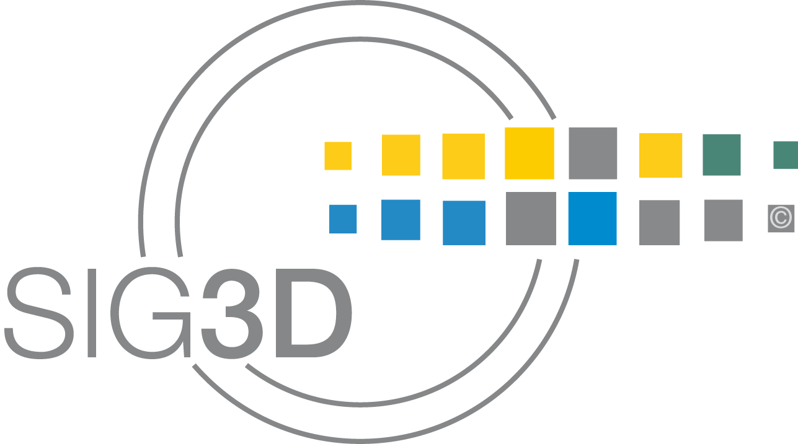
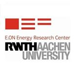
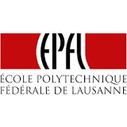
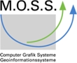
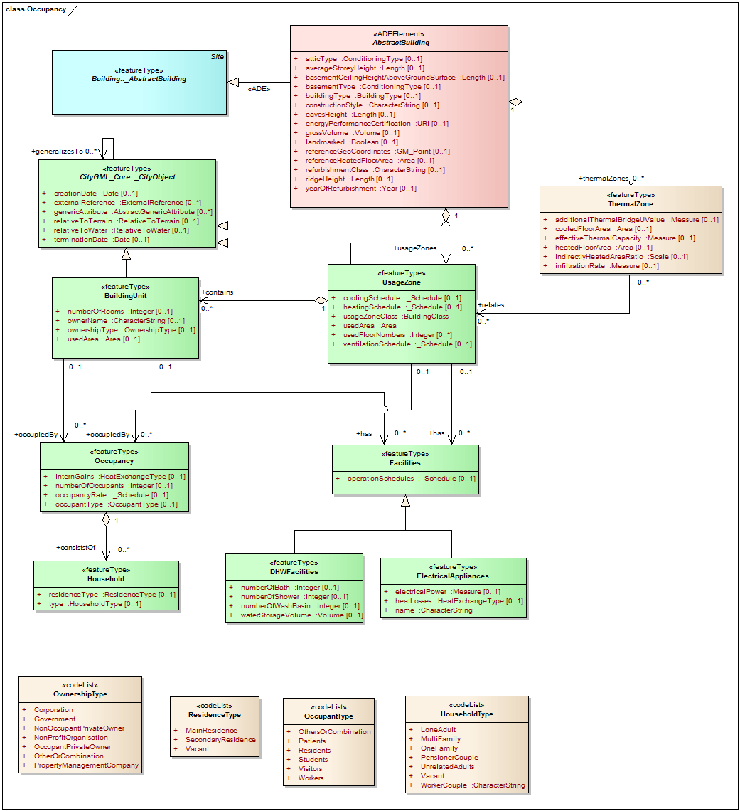
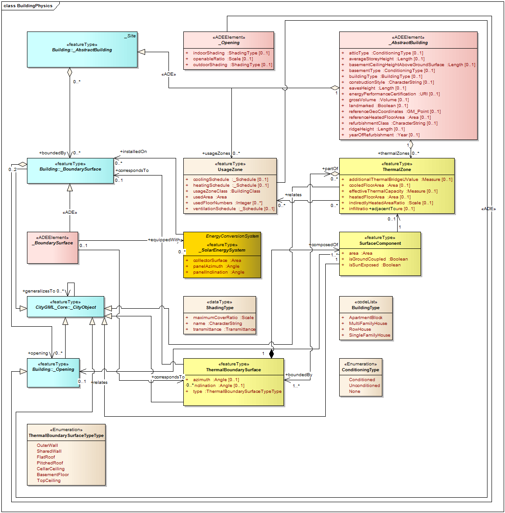
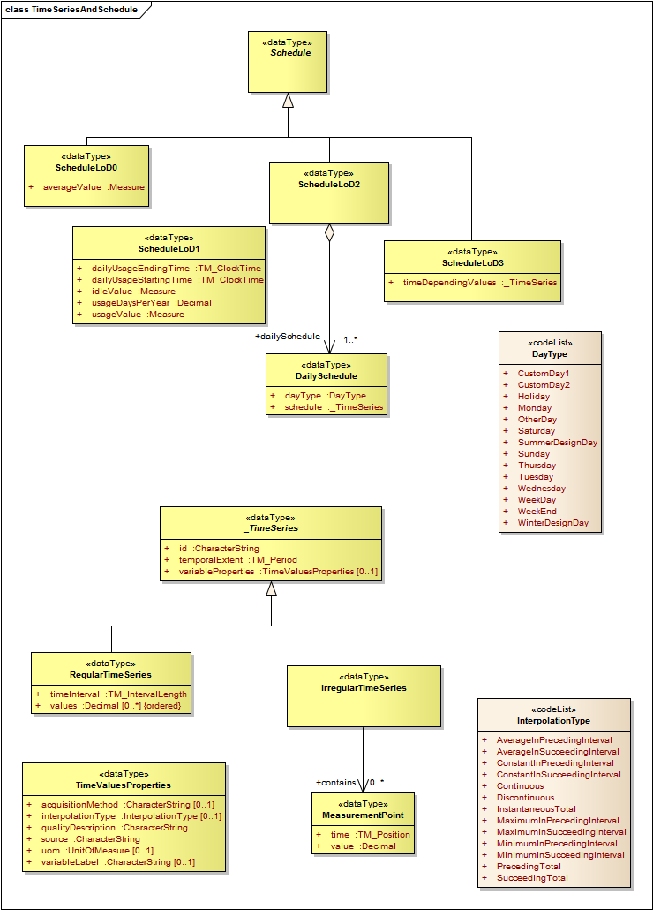
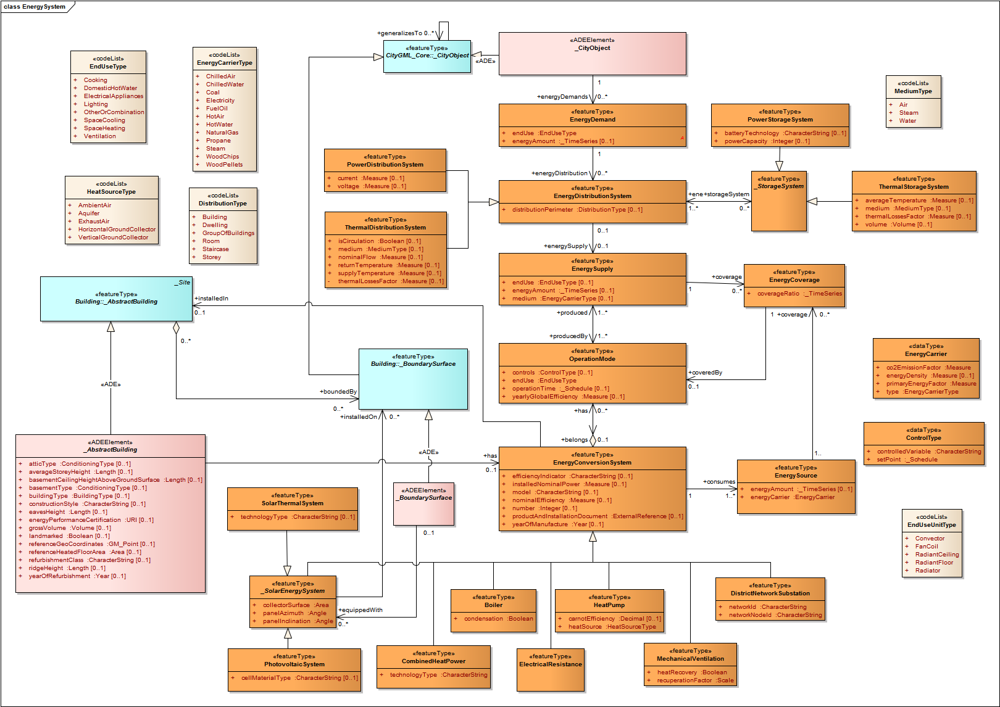
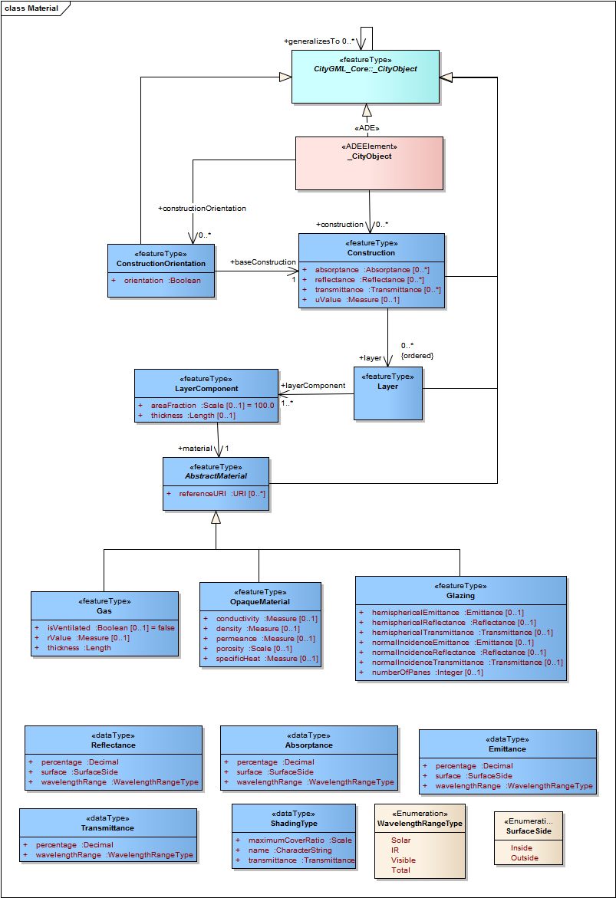

# CityGML Energy ADE

## Abstract
The Application Domain Extension (ADE) Energy defines a standardized data model based on CityGML format for urban energy analyses, aiming to be a reference exchange data format between different urban modelling tools and expert databases.

A documentation of each classes and parameters is in development on [iCloud](https://www.icloud.com/numbers/AwBWCAESEGokFkzrlOmbyLGSLf4aK1MaKml1UIi8WFdwYdhK0UTcW3yK1E1VdLPbAvkAdtkW6y9YHtsf7z8AYI2nqQMCUCAQEEICNf39VHMKgzmmsZDBWw4hJ1n2O0bfur2wdp6Xm6i0ZA#Definitionen).

The latest ADE release is version 0.6.0. All releases can be found and downloaded on the [releases page](https://github.com/cstb/citygml-energy/releases) of the repository.

It has been developed since May 2014 by an international consortium of urban energy simulation developers and users:
* Special Interest Group 3D (SIG3D)
* University of Applied Sciences Stuttgart
* Technische Universität München
* Karlsruhe Institute für Technologie
* RWTH Aachen University / E.ON Energy Research Center
* HafenCityUniversität Hamburg
* European Institute for Energy Research
* Ecole Polytechnique Fédérale de Lausanne
* Centre Scientifique et Technique du Batiment
* Electricité de France
* Sinergis
* M.O.S.S Computer Grafik Systeme

     
    
    
    

## Authors
* Occupancy module
	* Jean-Marie Bahu (EIFER)
	* Esteban Munoz (Hafen City University)
	* Romain Nouvel (HFT Stuttgart)
	* Piergiorgio Cipriano (Sinergis)
	* Luca Giovannini (Sinergis)
* Core module
	* Karl-Heinz Häfele (KIT)
	* Joachim Benner (KIT)
	* Marcel Bruse(HFT Stuttgart)
	* Volker Coors (HFT Stuttgart)
	* Robert Kaden (TUM)
	* Moritz Lauster (RWTH Aachen)
	* Henryk Wolisz (RWTH Aachen)
	* Sawsan Mohamed (Universität Stuttgart)
	* Romain Nouvel (HFT Stuttgart)
	* Piergiorgio Cipriano (Sinergis)
	* Luca Giovannini (Sinergis)
	* Jean-Marie Bahu (EIFER Karlsruhe)
	* Maryam Zirak (HFT Stuttgart)
* Energy Systems module
	* Moritz Lauster (RWTH Aachen)
	* Peter Remmen (RWTH Aachen)
	* Jean-Marie Bahu (EIFER)
	* Eric Duminil (HFT Stuttgart)
	* Dirk Monien (HFT Stuttgart)
	* Diane Perez (EPFL)
	* Romain Nouvel (HFT Stuttgart)
	* Piergiorgio Cipriano (Sinergis)
	* Luca Giovannini (Sinergis) 
* Material module
	* Karl-Heinz Häfele (KIT)
	* Joachim Benner (KIT)
* Enterprise Architect UML model
	* Romain Nouvel (HFT Stuttgart)
	* Marcel Bruse (HFT Stuttgart)
	* Olivier Tournaire (CSTB)
	* Joachim Benner (KIT)
* UML model to XSD schema conversion
	* Olivier Tournaire (CSTB)
* Sample file
	* Marcel Bruse (HFT Stuttgart)

## Guidelines
A document which describes the guidelines can be downloaded from [this link](./guidelines/Guidelines_EnergyADE.pdf). The guidelines can also be read [online](./guidelines/Guidelines_EnergyADE.md).

## UML diagrams
The CityGML Energy ADE currently (v0.5.0) is implemented in a single XSD schema. The following diagrams give an overview of each modules.
### Occupancy module

### Building physics module (core)

### Time series and schedule module (core)

### Energy system module

### Material module

