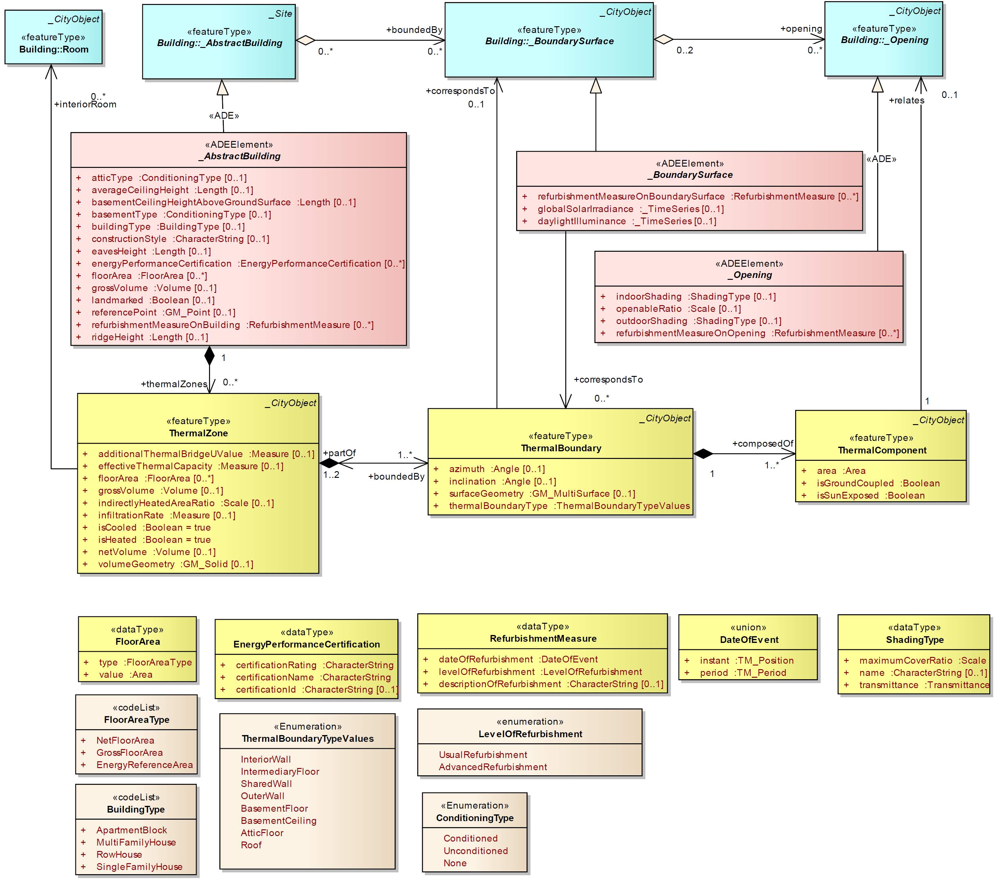
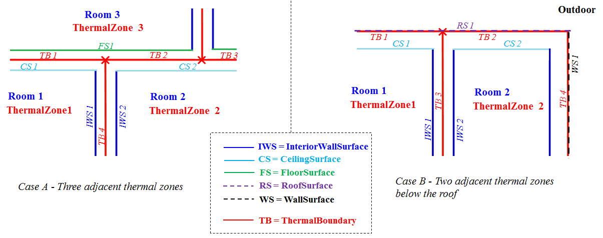
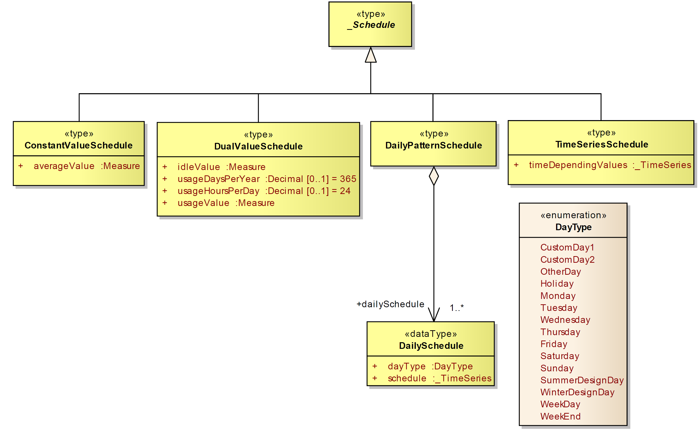
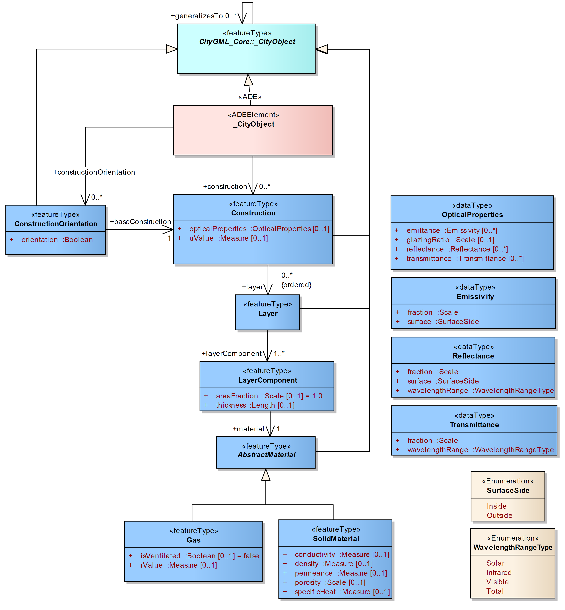
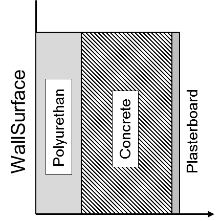
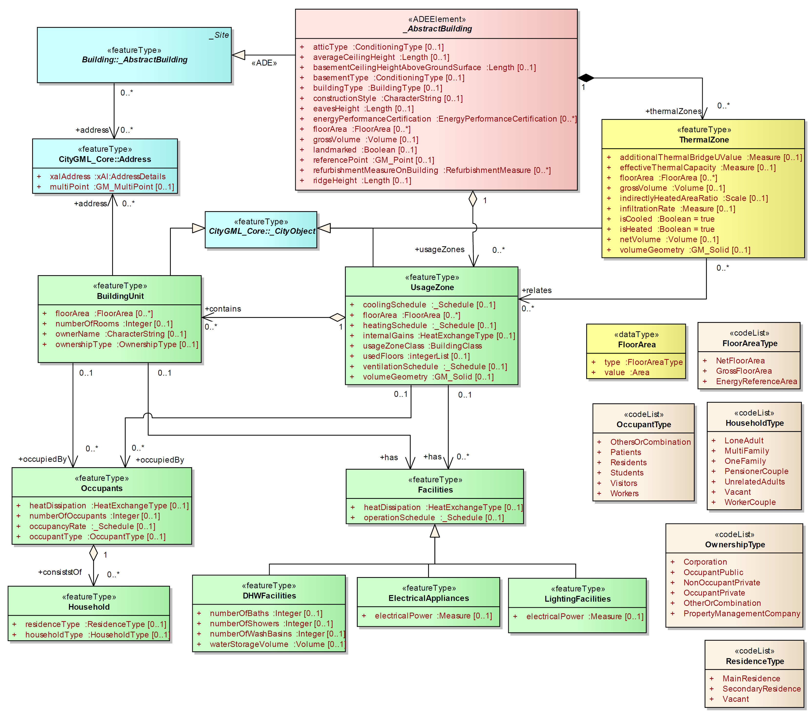
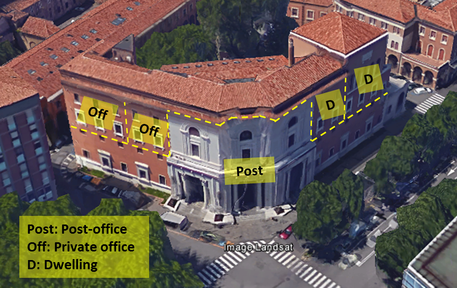
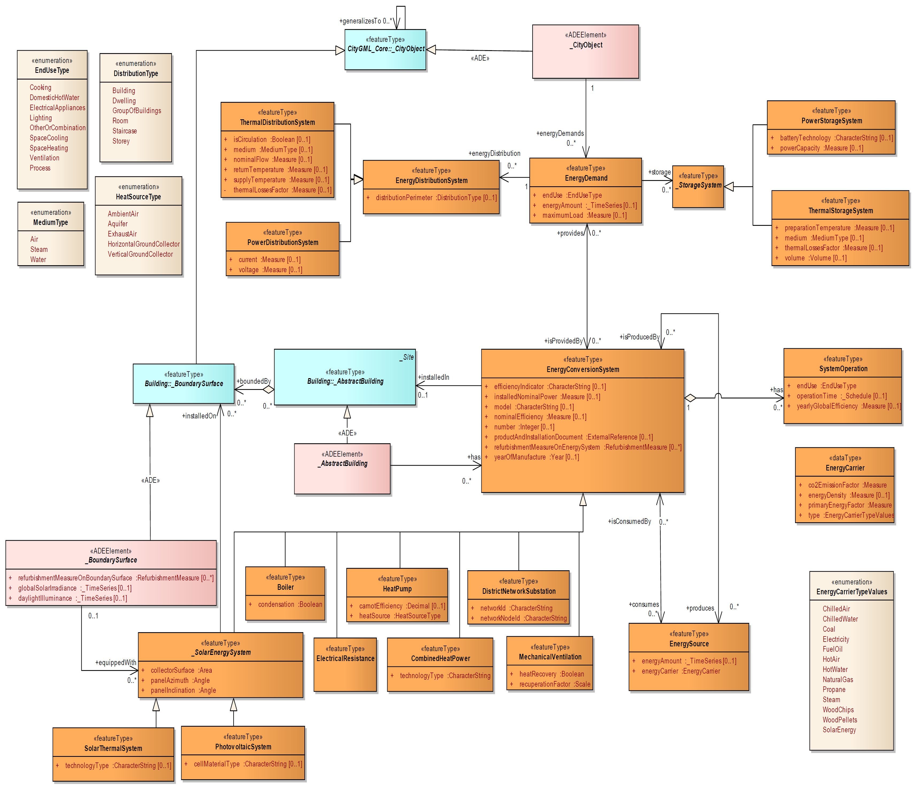

# Overview of the Energy Application Domain Extension

## Motivation and design objectives

The CityGML Energy Application Domain Extension (Energy ADE) aims at extending the CityGML 2.0 standard with energy-related entities and attributes necessary to perform energy analyses at urban scale, such as energy demand diagnostics, solar potential study, simulation of low-carbon energy strategies etc...

In accordance with the philosophy of CityGML, the Energy ADE aims to be flexible in terms of compatibility with different data qualities and levels of details. His design is driven by the following objectives : 
- store and manage energy-related data collected at urban scale, based on the standard data specification of INSPIRE Directive of the European Parliament, as well as the recent US Building Energy Data Exchange Specification (BEDES). 
- provide information data required by different urban energy models and simulation (e.g. from standard energy balance methods as of ISO 13790, to sub-hourly dynamic simulations by means of software programs like CitySim or EnergyPlus)

## General structure overview

Its structure is conceived to be modular, so as to be potentially used and extended also for other applications (e.g. module Occupancy for socio-economics, module Construction and Materials for acoustics or statics, etc). It consists of 5 modules:
- Building Physics module,
- Occupancy module,
- Construction and Material module,
- Energy Use and System module,
- Timeseries and Schedules module.

The Building Physics module is the core of the Energy ADE. It extends the existing CityGML objects (Abstract Building, BoundarySurface and Opening) and relate them to new thermal entities (ThermalZone, ThermalBoundary, resp. ThermalComponent). Its central object is the ThermalZone, which is the volume unit for heat/cool energy demand calculation.

The Occupancy module is related to the CityGML model (AbstractBuilding) and Building Physics Module (ThermalZone) through its central object : UsageZone. The latter is the spatial unit for user-depending energy use study (e.g. domestic hot water, electrical appliances) and can provide usage boundary conditions for the heat/cool energy demand calculations.

The Construction and Material, Energy Use and System, and Timeseries and Schedules modules are independant « floating modules » which may be connected to different CityGML and Energy ADE CityObjects. 


This document is intended to explain the characteristics and purposes of each module, their entities and attributes. It provides also a number of XML examples, illustrating how and where the Energy ADE entities and attributes may be embedded into CityGML.

# Building Physics Module

## Module overview and main relationships



Main purpose of this module is building thermal modeling (e.g. calculation of space heating and space cooling demands).

Thus, it extends the existing CityGML objects `_AbstractBuilding`, `_BoundarySurface`and `_Opening` with energy-related attributes, and define new thermal building objects `ThermalZone`, `ThermalBoundary`, respectively `ThermalComponent` related to them.

The `ThermalZone `is the unit volume for heating and cooling demand calculation. A Building may have several `ThermalZone`, for instance in the case of mixed-usage building, or to distinguish rooms or zones with different orientations (i.e. solar gains) and/or thermal behaviour.

These `ThermalZone` objects are separated from each other and from the outside by `ThermalBoundary` objects. These `ThermalBoundary` objects may or not correspond to the CityGML `_BoundarySurface`. To count the `globalSolarIrradiance` incident on `_BoundarySurface` in the building energy balance, every `ThermalBoundary` delimiting the `ThermalZone` from outside should however be related (relation `correspondsTo`) with a `_BoundarySurface`.

If occupied, a `ThermalZone` must be related to at less 1 `UsageZone`, which contains the usage boundary conditions required for the heating and cooling demand calculation (see Occupancy Module). One `ThermalZone` may be related to several `UsageZone` for simplified modelling of mixed-usage space, in which case the usage boundary conditions of the `UsageZone` should be aggregated or weighted
according with their floorArea.

## Extension of CityGML building objects

### \_AbstractBuilding

The Energy ADE extends the CityGML _AbstractBuilding by a number of
energy-related attributes, e.g with regards to the geometrical characteristics
(`referencePoint`, `averageCeilingHeight`, `eavesHeight`, `ridgeHeight`,
`basementCeilingHeightAboveGrounSurface`, `floorArea`, `grossVolume`), to the
conditioning of basement and attic (`basementType`, `atticType`), to the
available energy certificates (`energyPerformanceCertification`) and
refurbishment measures (`RefurbishmentMeasureOnBuilding`), and other building
information useful for building typology categorisations (`buildingType` and
`constructionStyle`).

All these attributes are optional. Some of them, like `floorArea` and  
`energyPerformanceCertification`, have a cardinality [0..*] and may
consequently be attributed several times to a building, specifying different
values for different `FloorAreaType`, respectively `certificationName`.

Finally, because `_AbstractBuilding` inherits from `_CityObject`, further
objects may be assigned to it, like `EnergyDemand` in particular (see Module
Energy and Systems).

In the following, an extract of CityGML file for a building is given, included
some of its Energy ADE attributes.

```xml
<!--Examples of Building with Energy ADE attributes-->
<bldg:Building gml:id="id_building_1">
 <gml:description>Description of Building 1</gml:description>
 <gml:name>Name of Building 1</gml:name>
 <energy:referencePoint>
  <gml:Point gml:id="id_building_referencepoint_1" srsName="EPSG:31256" srsDimension="3">
   <gml:pos>2525.5 338567.5 162.6</gml:pos>
  </gml:Point>
 </energy:referencePoint>
 <energy:basementType>Unconditioned</energy:basementType>
 <energy:energyPerformanceCertification>
  <!--Here come the EnergyPerformanceCertification objects (see later) -->
 </energy:energyPerformanceCertification>
 <energy:basementCeilingHeightAboveGroundSurface uom="m">1</energy:basementCeilingHeightAboveGroundSurface>
 <energy:grossVolume uom="m^3">1050</energy:grossVolume>
 <energy:refurbishmentMeasureOnBuilding>
  <energy:RefurbishmentMeasure>
   <!--Here come all attributes of a RefurbishmentMeasure object (omitted here)-->
  </energy:RefurbishmentMeasure>
 </energy:refurbishmentMeasureOnBuilding>
 <energy:averageCeilingHeight uom="m">2.7</energy:averageCeilingHeight>
 <energy:atticType>Conditioned</energy:atticType>
 
 <!--Here may come a list of UsageZone of the building (see Module Occupancy) -->
 
 <energy:ridgeHeight uom="m">10.5</energy:ridgeHeight>
 <energy:landmarked>false</energy:landmarked>
 <energy:floorArea>
  <!--Here come the floorArea objects (see later)-->
 </energy:floorArea>
 <energy:eavesHeight uom="m">8</energy:eavesHeight>
 <energy:constructionStyle>Massive</energy:constructionStyle>
 <energy:buildingType>MultiFamilyHouse</energy:buildingType>
 
 <!--Here follow all ThermalZone objects, each inside a "thermalZones" tag-->
 <energy:thermalZones>
  <energy:ThermalZone gml:id="id_thermalzone_1">
   <!--Here come all attributes of the first ThermalZone (omitted here)-->
  </energy:ThermalZone>
 </energy:thermalZones>
 <energy:thermalZones>
  <energy:ThermalZone gml:id="id_thermalzone_2">
   <!--Here come all attributes of the second ThermalZone (omitted here)-->
  </energy:ThermalZone>
 </energy:thermalZones>
</bldg:Building>
```

#### FloorArea

Buildings (`_AbstractBuilding`) and building zones (`ThermalZone` and
`UsageZone`) may have several `floorArea`, related to several `FloorAreaType`
(e.g. net floor area, gross floor area, energy reference area).

```xml
<!--Examples of three floor areas-->
<energy:FloorArea>
	<energy:FloorArea>
		<energy:type>GrossFloorArea</energy:type>
		<energy:value uom="m^2">50.0</energy:value>
	</energy:FloorArea>
	<energy:FloorArea>
		<energy:type>NetFloorArea</energy:type>
		<energy:value uom="m^2">40.0</energy:value>
	</energy:FloorArea>
	<energy:FloorArea>
		<energy:type>EnergyReferenceArea</energy:type>
		<energy:value uom="m^2">43.0</energy:value>
	</energy:FloorArea>
</energy:FloorArea>
```

#### EnergyPerformanceCertification

A building may present several  
`energyPerformanceCertification` related to
different `certificationName` (e.g. PassivHaus, LEED) and/or different
certification dates (specificied by `certificationId`).

```xml
<!--Example of two energy performance certifications-->
<energy:energyPerformanceCertification>
    <energy:EnergyPerformanceCertification>
        <energy:certificationRating>Platinum</energy:certificationRating>
        <energy:certificationName>LEED</energy:certificationName>
        <energy:certificationId>0815</energy:certificationId>
    </energy:EnergyPerformanceCertification>
    <energy:EnergyPerformanceCertification>
        <energy:certificationRating>Passive house</energy:certificationRating>
        <energy:certificationName>EnerPHit</energy:certificationName>
        <energy:certificationId>4756</energy:certificationId>
    </energy:EnergyPerformanceCertification>
</energy:energyPerformanceCertification>

```

#### RefurbishmentMeasure

Energy-efficient refurbishment operations and measures may be indicated as
attribute of `_AbstractBuilding`, `_BoundarySurface` and `_Opening`. The
`RefurbishmentMeasure` object contains two information: the date and level of
refurbishment.

The attribute `levelOfRefurbishment` is a codeList whose elements generally
relates to refurbishment measure libraries or to a building typology
categorisation.

The attribute `dateOfRefurbishment` is defined by the GML type `DateOfEvent`,
and may consequently be specified in different manners (see the 3 examples
below).

```xml
<!--Example of a Refurbishment Measure on a building with a very vague date ("before June 2010") -->
<energy:refurbishmentMeasureOnBuilding>
    <energy:RefurbishmentMeasure>
        <energy:dateOfRefurbishment>
            <energy:DateOfEvent>
                <energy:instant indeterminatePosition="before">2010-06</energy:instant>
            </energy:DateOfEvent>
        </energy:dateOfRefurbishment>
        <energy:levelOfRefurbishment>UsualRefurbishment</energy:levelOfRefurbishment>
        <gml:description>Refurbishment consisting of an outside insulation of walls etc.</gml:description>
    </energy:RefurbishmentMeasure>
</energy:refurbishmentMeasureOnBuilding>
```

```xml
<!--Example of an advanced Refurbishment Measure in the years 1998 and 1999 -->
<energy:refurbishmentMeasureOnBuilding>
    <energy:RefurbishmentMeasure>
        <energy:dateOfRefurbishment>
            <energy:DateOfEvent>
                <energy:period>
                    <gml:TimePeriod>
                        <gml:beginPosition>1998</gml:beginPosition>
                        <gml:endPosition>2000</gml:endPosition>
                    </gml:TimePeriod>
                </energy:period>
            </energy:DateOfEvent>
        </energy:dateOfRefurbishment>
        <energy:levelOfRefurbishment>AdvancedRefurbishment</energy:levelOfRefurbishment>
    </energy:RefurbishmentMeasure>
</energy:refurbishmentMeasureOnBuilding>
```

```xml
<!--Example of an usual Refurbishment Measure in June 2012 -->
<energy:refurbishmentMeasureOnBuilding>
    <energy:RefurbishmentMeasure>
        <energy:dateOfRefurbishment>
            <energy:DateOfEvent>
                <energy:instant>2012-06</energy:instant>
            </energy:DateOfEvent>
        </energy:dateOfRefurbishment>
        <energy:levelOfRefurbishment>UsualRefurbishment</energy:levelOfRefurbishment>
    </energy:RefurbishmentMeasure>
</energy:refurbishmentMeasureOnBuilding>
```

### \_Opening

The CityGML abstract class `_Opening` (inherited by the objects `Window` and
`Door`) is extended in this Energy ADE by a number of energy-related
attributes.

First of all, an optional attribute `openableRatio` details the proportion of
the opening area which may be opened. An indoor and an outdoor shading system
may complement the opening, with a `ShadingType` characterized by a
`transmittance` (see details in Module Materials and Constructions) and a
`maximumCoverRatio`. Finally, information about possible refurbishment measures
and operations may also be added at the level of the opening (e.g window
exchange), through the attribute `refurbishmentMeasureOnOpening` of type
`RefurbishmentMeasure`.

As in the Building example shown before, the standard CityGML attributes have
been omitted for better readability. The door example is simpler and contains
also information about construction and construction orientation (by means of
Xlinks).

```xml
<!--Example of a Window object -->
<bldg:Window gml:id="id_window_1">
	<gml:description>This is window with an outside rolling shutter and curtains inside</gml:description>
	<gml:name>Window with rolling shutter and curtains</gml:name>

	<energy:outdoorShading>
		<energy:ShadingType>
			<energy:maximumCoverRatio uom="ratio">1</energy:maximumCoverRatio>
			<energy:name>Rolling shutter</energy:name>
			<energy:transmittance>
				<energy:Transmittance>
					<energy:fraction uom="ratio">0</energy:fraction>
					<energy:wavelengthRange>Total</energy:wavelengthRange>
				</energy:Transmittance>
			</energy:transmittance>
		</energy:ShadingType>
	</energy:outdoorShading>

	<energy:indoorShading>
		<energy:ShadingType>
			<energy:maximumCoverRatio uom="ratio">0.5</energy:maximumCoverRatio>
			<energy:name>Curtain</energy:name>
			<energy:transmittance>
				<energy:Transmittance>
					<energy:fraction uom="ratio">0.8</energy:fraction>
					<energy:wavelengthRange>Total</energy:wavelengthRange>
				</energy:Transmittance>
			</energy:transmittance>
		</energy:ShadingType>
	</energy:indoorShading>

	<energy:openableRatio uom="ratio">0.9</energy:openableRatio>

</bldg:Window>
```

### \_BoundarySurface, globalSolarIrradiance and daylightIlluminance

The CityGML abstract class `_BoundarySurface` is extended by a number of Energy
ADE attributes, in order in particular to store the incident global solar
irradiances and the daylight illuminances available on each outside boundary
surface of the building. Moreover,  information about refurbishment measures on
roof or facade can characterised the `_BoundarySurface` objects, in the same
way that the buildings and openings, through the attribute
`refurbishmentMeasureOnBoundarySurface` of type `RefurbishmentMeasure`.

The `globalSolarIrradiance` is the sum of the direct, diffuse and reflected
irradiance incident on a outside boundary surface and is generally expressed in
Watts per square metre.  These global solar irradiance is generally used for
the thermal calculations within the buildings, but also for the calculation of
the energy yield produced by the solar systems (e.g. photovoltaic and solar
thermal panels).

The `daylightIlluminance` is the sum of the direct, diffuse and reflected solar
illuminance incident on a outside boundary surface. It is generally expressed
in Lux. Daylight illuminance is typically used for outside and inside
daylighting study, as well as the calculation of the energy consumptions of
lighting systems required to reach the room illuminance threshold when the
daylight illuminance is not enough.

Both `globalSolarIrradiance` and `daylightIlluminance` attributes are
`_Timeseries` data (see details in Temporal Data Module).  In the following, a
XML example of a roof is given.

```xml
<!--Example of a Roof object -->
<bldg:RoofSurface gml:id="id_roof_1">
	<gml:description>Description of Roof 1</gml:description>
	<gml:name>Name of Roof 1</gml:name>

	<energy:refurbishmentMeasureOnBoundarySurface>
		<energy:RefurbishmentMeasure>
			<!--Here come all attributes of a RefurbishmentMeasure object (omitted here)-->
		</energy:RefurbishmentMeasure>
	</energy:refurbishmentMeasureOnBoundarySurface>

	<energy:globalSolarIrradiance>
		<!--Add here the TimeSeries data -->
	</energy:globalSolarIrradiance>

	<energy:daylightIlliminance>
		<!--Add here the TimeSeries data -->
	</energy:daylightIlliminance>

</bldg:RoofSurface>
```

## Thermal zones, thermal boundaries and thermal components

### ThermalZone

The `ThermalZone` is a new object introduced in the Energy ADE to realize
building heating and cooling demand calculation. A `ThermalZone` is a zone of a
`Building` (or of a `BuildingPart`) which serves as the smallest spatial zone
for building heating and cooling demand calculation. It is generally a "thermal
homogeneous" space considered as isothermal, but may also refer to several
building rooms and zones with different usage boundary conditions for
simplified building energy modelling.

A `ThermalZone` contains a series of energy-related attributes which
characterize its geometry (`floorArea`, `grossVolume`, `netVolume`,
`volumeGeometry`), its conditioning status (`isCooled`, `isHeated`,
`indirectlyHeatedAreaRatio`) and overall building physics properties
(`additionalThermalBridgeUValue`, `infiltration rate`,
`effectiveThermalCapacity`).

All these attributes are optional. Among those, `floorArea` may be attributed
several times to a building, specifying different values for different
`FloorAreaType`. A `ThermalZone` may optionally contain an explicit volume
geometry (specified by `volumeGeometry`), useful in particular for
visualisation purposes, but not necessary for heating and cooling demand
calculations. The `ThermalZone` may also be related to a room (`gml:Room`). The
actual surface boundaries of a `ThermalZone` are defined by means of
`ThermalBoudary` objects (see later).

If occupied, a `ThermalZone` must be related to at less one `UsageZone` object
(see Occupancy Module), which contains the usage boundary conditions for the
heating and cooling demand calculation (see Occupancy Module). `ThermalZone`
may even be related to several `UsageZone` for simplified modelling of
mixed-usage space, in which case the usage boundary conditions of the UsageZone
should be aggregated or weighted according with their `floorArea`.

The class `ThermalZone` inherits from `_CityObject`, and may therefore be
associated to one or more `EnergyDemand` objects (see module Energy Systems).

In the following, Two XML examples present a `ThermalZone`, with and without
explicit volume geometry.

```xml
<!--Example of a ThermalZone without explicit volume geometry-->
<energy:ThermalZone gml:id="id_thermalzone_1">
	<gml:description>Description of Thermal Zone 1</gml:description>
	<gml:name>Name of Thermal Zone 1</gml:name>
	<energy:additionalThermalBridgeUValue uom="W/(K*m^2)">0.5</energy:additionalThermalBridgeUValue>
	<energy:effectiveThermalCapacity uom="J/K">500</energy:effectiveThermalCapacity>
	<energy:floorArea>
		<energy:FloorArea>
			<energy:type>EnergyReferenceArea</energy:type>
			<energy:value uom="m^2">55.0</energy:value>
		</energy:FloorArea>
	</energy:floorArea>
	<energy:grossVolume uom="m^3">200.0</energy:grossVolume>

	<!-- here follows a related usage zone -->
	<energy:relates xlink:href="#id_usagezone_1"/>

	<energy:indirectlyHeatedAreaRatio uom="ratio">0.15</energy:indirectlyHeatedAreaRatio>
	<energy:infiltrationRate uom="1/h">1.2</energy:infiltrationRate>
	<energy:isCooled>true</energy:isCooled>
	<energy:isHeated>true</energy:isHeated>
	<energy:netVolume uom="m^3">180.0</energy:netVolume>

	<!--Here follow all ThermalBoundary objects, each inside a "boundedBy" tag-->
	<energy:boundedBy>
		<energy:ThermalBoundary gml:id="id_thermalboundary_1">
			<!--Here come all attributes of the first ThermalBoundary (omitted here)-->
		</energy:ThermalBoundary>
	</energy:boundedBy>
	<energy:boundedBy>
		<energy:ThermalBoundary gml:id="id_thermalboundary_2">
			<!--Here come all attributes of the second ThermalBoundary (omitted here)-->
		</energy:ThermalBoundary>
	</energy:boundedBy>

</energy:ThermalZone>
```

```xml
<!--Example of a ThermalZone with explicit volume geometry-->
<energy:ThermalZone gml:id="id_thermalzone_2">
	<!--Additional attributes of the ThermalZone (omitted here)-->

	<energy:volumeGeometry>
		<gml:Solid gml:id="id_thermalzone_volume_geometry_1" srsName="EPSG:31256" srsDimension="3">
			<gml:exterior>
				<gml:CompositeSurface>
					<gml:surfaceMember>
						<gml:Polygon>
							<gml:exterior>
								<gml:LinearRing>
									<gml:posList>0 0 0 0 10 0 5 10 0 5 0 0 0 0 0</gml:posList>
								</gml:LinearRing>
							</gml:exterior>
						</gml:Polygon>
					</gml:surfaceMember>
					<gml:surfaceMember>
						<gml:Polygon>
							<gml:exterior>
								<gml:LinearRing>
									<gml:posList>0 0 4 5 0 4 5 10 4 0 10 4 0 0 4</gml:posList>
								</gml:LinearRing>
							</gml:exterior>
						</gml:Polygon>
					</gml:surfaceMember>
					<!--Here come further surfaceMember objects-->
					</gml:CompositeSurface>
			</gml:exterior>
		</gml:Solid>
	</energy:volumeGeometry>
</energy:ThermalZone>
```

### ThermalBoundary

A `ThermalBoundary` represent the physical relationship between two
`ThermalZone`, or one `ThermalZone` and the building environment. Its
geometrical representation is a coplanar, or quasi coplanar, surface.

Each `ThermalZone` is geometrically closed by its whole set of bounding
`ThermalBoundary` (specificied in the relationship "boundedBy").

In the case where the `ThermalBoundary` delimits one `ThermalZone` from the
building environment, corresponding then to the external boundary of a
building, its geometrical representation coincides with the external surfaces
of the related outer wall/roof/basement floor. In this case, the
`ThermalBoundary` should be linked to the corresponding `_BoundarySurface`
object (e.g. a `WallSurface`, a `RoofSurface`, a `GroundSurface` in LoD2) if
existing, through the relationship "correspondsTo". It may however occurs that
such `ThermalBoundary` does not match with any `_BoundarySurface` (e.g.
basement ceiling, attic floor).

In the case where the `ThermalBoundary` separate two adjacent `ThermalZone`,
corresponding then to an intermediate floor, ceiling, or a shared wall, its
geometrical representation coincides with the plan laying at the middle of this
construction thickness.

The following figure represents these 2 different cases in a building side
section, relating the Energy ADE objects `ThermalZone` and `ThermalBoundary` to
the CityGML objects `Room` and `_BoundarySurface`.



`ThermalBoundary` may contain attributes characterizing their type  
(`thermalBoundaryType`), orientation (`azimuth` and `inclination`) and explicit
geometry (`surfaceGeometry`). All these attributes are optional. Thus, a
`ThermalZone` may optionally contain an explicit surface geometry (specified by
`surfaceGeometry`), useful in particular for visualisation purposes if the
`ThermalBoundary` does not coincide with any `_BoundarySurface`, but not
necessary for heating and cooling demand calculations.

The `ThermalBoundaryType` type is slightly different to the types of
`_BoundarySurface` from CityGML, integrating further thermal boundaries like
AtticFloor, BasementCeiling, BasementFloor or SharedWall.

Each `ThermalBoundaryType` is composed of `ThermalComponent` (e.g. wall
construction, windows etc.) which holds the `Construction`.

In the following, two XML examples of `ThermalBoundary`, with and without
explicit geometry are given.

```xml
<!--Example of a ThermalBoundary corresponding to a building roof, delimiting a thermal zone -->
<energy:ThermalBoundary gml:id="id_thermalboundary_1">
	<gml:description>Thermal Boundary 1</gml:description>
	<gml:name>Thermal Boundary 1</gml:name>
	<energy:azimuth uom="decimal degrees">135</energy:azimuth>
	<energy:inclination uom="decimal degrees">55</energy:inclination>
	<energy:thermalBoundaryType>Roof</energy:thermalBoundaryType>
	<partOf xlink:href="#id_thermalzone_1"/>
	<energy:composedOf>
		<energy:ThermalComponent gml:id="id_thermalcomponent_1">
			<!--Here come all attributes of the first ThermalComponent (omitted here)-->
		</energy:ThermalComponent>
	</energy:composedOf>
	<energy:composedOf>
		<energy:ThermalComponent gml:id="id_thermalcomponent_2">
			<!--Here come all attributes of the second ThermalComponent (omitted here)-->
		</energy:ThermalComponent>
	</energy:composedOf>
	<correspondsTo xlink:href="#id_RoofSurface_1"/>
</energy:ThermalBoundary>
```

```xml
<!--Example of a ThermalBoundary with explicit surface geometry, separating two thermal zones -->
<energy:ThermalBoundary gml:id="id_thermalboundary_2">
	<!--Additional attributes of the ThermalBoundary class (omitted here)-->

	<energy:surfaceGeometry>
		<gml:MultiSurface gml:id="id_thermalboundary_2_surface_geometry" srsName="EPSG:31256" srsDimension="3">
			<gml:surfaceMember>
				<gml:Polygon>
					<gml:exterior>
						<gml:LinearRing>
							<gml:posList>0 0 0 0 10 0 5 10 0 5 0 0 0 0 0</gml:posList>
						</gml:LinearRing>
					</gml:exterior>
				</gml:Polygon>
			</gml:surfaceMember>
		</gml:MultiSurface>
	</energy:surfaceGeometry>
	<partOf xlink:href="#id_thermalzone_1"/>
	<partOf xlink:href="#id_thermalzone_2"/>
</energy:ThermalBoundary>
```

### ThermalComponent

A `ThermalComponent` object is a part of the thermal boundary corresponding to
a homogeneous construction component (e.g. windows, wall, insulated part of a
wall etc.) and either entirely above or below the terrain. 
Each `ThermalComponent` must be characterized with its `Area`, and its position relative to the Terrain (attribute `relativeToTerrain` which it inherits from `_CityObject`).

Since `ThermalComponent` inherits from `_CityObject`, it can also be associated to a
`Construction` object (see module Construction and Material). This may be done
either inline or by means of xlinks (see example below). In this way,
`ThermalComponent` provides the physical properties of the building envelope to
calculate the heating and cooling demand.

```xml
<!--Example of a Facade with 20% window to wall ratio -->
<energy:ThermalBoundary gml:id="Id_Facade_1">
	<energy:thermalBoundaryType>OuterWall</energy:thermalBoundaryType>
	<energy:partOf xlink:href="ID_ZONE_1"/>
	<energy:composedOf>
		<energy:ThermalComponent gml:id="id_Wall_1">
	  		<gml:description>Part of the facade of wall</gml:description>
	  		<relativeToTerrain>entirelyAboveTerrain</relativeToTerrain>
	  		<energy:construction xlink:href="#id_WallConstruction_1"/>
	  		<energy:area uom="m^2">40.0</energy:area>
    		</energy:ThermalComponent>
  	</energy:composedOf>
  	<energy:composedOf>
		<energy:ThermalComponent gml:id="id_Window_1">
	      		<gml:description>Part of the facade of windows</gml:description>
	      		<relativeToTerrain>entirelyAboveTerrain</relativeToTerrain>
	      		<energy:construction xlink:href="#id_WindowConstruction_1"/>
	      		<energy:area uom="m^2">10.0</energy:area>
	      		<energy:relates xlink:href="#opening_window_1"/>
    		</energy:ThermalComponent>
  	</energy:composedOf>				
</energy:ThermalBoundary>
```

# Temporal Data Module

This module introduces the two new types `_TimeSeries` and `_Schedules`,
essential to model the time-depending inputs and results of urban energy
analyses. These types are used in other Modules of the Energy ADE, in
particular the module Occupancy and module Energy and Systems.

As theses types are actually not domain-specific, we are collaborating with the
development team of the CityGML 3.0 to integrate them in the new CityGML 3.0 to
come (as Dynamizer).

## Time Series


Time series are homogeneous lists of time-depending values. They are used in
the Energy ADE to store energy amount or an occupancy schedule, for instance. 

All time series share some common properties, gathered in the
`TimeValuesProperties` type object. This object specifies optionally the
`acquisitionMethod` (e.g. simulated with software X, measured with heat meter),
`interpolationType` (based on the [WaterML ADE][] to know for instance if
measured data are "Average in Preceding Interval", or "Instantaneous Total"),
`qualityDescription` and `source` of the time series data.
Additionally, `_TimeSeries`may contain the the usual GML type attributes `name`
and `description`.

Time series can be either regular or irregular. `RegularTimeSeries` contain
`values` generated at regularly spaced interval of time (`timeInterval`), over
a given `temporalExtent` (i.e. start, end and duration time). They are used,
for instance, to store automatically acquired data or hourly/daily/monthly
simulation results.
In `IrregularTimeSeries`, data follows a temporal sequence, but the measurement
points may not happen at a regular time interval ([IBM knowledge Center][]).
Therefore, each value must be associated with a data or time.

Time series values may be also stored on an external file (e.g. csv or text),
both for regular (`RegularTimeSeriesFile`) and irregular time series
(`IrregularTimeSeriesFile`). A number of attributes must be detailed to
retrieve the `file`, interprete the formats and values inside it
(`decimalSymbol`, `recordSeparator`, `fieldSeparator`, `numberOfHeaderLines`,
`uom`), and know which values of the file should be read (`timeColumnNumber`
for irregular time series and `valueColumnNumber` for both of them). One file
with different records may be reused by different `RegularTimeSeriesFile` or
`IrregularTimeSeriesFile` with the corresponding `valueColumnNumber`.

In the following, four examples of time series illustrates the four types of
time series. The variableProperties and gml attributes are presented in the
first example but not always repeated in the following examples for better
readibility.

Example of RegularTimeSeries object:

```xml
<!--Example of RegularTimeSeries object with daily values-->
<energy:RegularTimeSeries gml:id="id_timeseries_electricity_demand_1">
	<gml:description>Description of the time series id_timeseries_electricity_demand_1</gml:description>
	<gml:name>Name of the  time series id_timeseries_electricity_demand_1</gml:name>
	<energy:variableProperties>
		<energy:TimeValuesProperties>
			<energy:acquisitionMethod>Measured electronically with heat power</energy:acquisitionMethod>
			<energy:interpolationType>AverageInSucceedingInterval</energy:interpolationType>
			<energy:qualityDescription>Accurate (+/- 0.2 kWh)</energy:qualityDescription>
			<energy:source>Subcontracting company X</energy:source>
		</energy:TimeValuesProperties>
	</energy:variableProperties>
	<energy:temporalExtent>
		<gml:TimePeriod>
			<gml:beginPosition>2016-01-01</gml:beginPosition>
			<gml:endPosition>2016-12-31</gml:endPosition>
		</gml:TimePeriod>
	</energy:temporalExtent>
	<energy:timeInterval unit="day">1</energy:timeInterval>
	<energy:values uom="kWh">11.2 11.4 10.2 9.6 6.3 11.5 12.7 ... (truncated, set of 365 values) </energy:values>
</energy:RegularTimeSeries>
```

Example of IrregularTimeSeries object:
```xml
<!--Example of IrregularTimeSeries object listing one value per year-->
<energy:IrregularTimeSeries gml:id="id_timeseries_electricity_demand_1">
	<energy:variableProperties>
		<energy:TimeValuesProperties>
			<energy:acquisitionMethod>Manual read on electrical meter</energy:acquisitionMethod>
			<energy:interpolationType>InstantTotal</energy:interpolationType>
		</energy:TimeValuesProperties>
	</energy:variableProperties>
	<energy:uom uom="kWh"/>
	<energy:contains>
		<energy:MeasurementPoint>
			<energy:time>2010-02-24</energy:time>
			<energy:value>12050</energy:value>
		</energy:MeasurementPoint>
	</energy:contains>
	<energy:contains>
		<energy:MeasurementPoint>
			<energy:time>2011-02-15</energy:time>
			<energy:value>14050</energy:value>
		</energy:MeasurementPoint>
	</energy:contains>
	<energy:contains>
		<energy:MeasurementPoint>
			<energy:time>2012-03-01</energy:time>
			<energy:value>16245</energy:value>
		</energy:MeasurementPoint>
	</energy:contains>
</energy:RegularTimeSeries>
```

Example of RegularTimeSeriesFile object:
```xml
<!--Example of RegularTimeSeriesFile object with hourly values contained in a file-->
<energy:RegularTimeSeriesFile gml:id="id_regulartimeseries_file_1">
	<energy:uom uom="W/m^2"/>
	<energy:file>file_name_containing_values.csv</energy:file>
	<energy:temporalExtent>
		<gml:TimePeriod>
			<gml:beginPosition>2008-01-01</gml:beginPosition>
			<gml:endPosition>2008-12-31</gml:endPosition>
		</gml:TimePeriod>
	</energy:temporalExtent>
	<energy:timeInterval unit="hour">1</energy:timeInterval>
	<energy:numberOfHeaderLines>1</energy:numberOfHeaderLines>
	<energy:valueColumnNumber>1</energy:valueColumnNumber>
	<energy:fieldSeparator>\t</energy:fieldSeparator>
</energy:RegularTimeSeriesFile>
```

Example of IrregularTimeSeriesFile object:
```xml
<!--Example of IrregularTimeSeriesFile object-->
<energy:RegularTimeSeriesFile gml:id="id_regulartimeseries_file_1">
	<energy:uom uom="W/m^2"/>
	<energy:file>file_name_containing_values.csv</energy:file>
	<energy:numberOfHeaderLines>1</energy:numberOfHeaderLines>
	<energy:recordSeparator> </energy:recordSeparator>
	<energy:decimalSymbol>,</energy:decimalSymbol>
	<energy:valueColumnNumber>9</energy:valueColumnNumber>
	<energy:timeColumnNumber>1</energy:timeColumnNumber>
	<energy:fieldSeparator>\t</energy:fieldSeparator>
</energy:RegularTimeSeriesFile>
```

## Schedules



The type `_Schedule` is used in the Energy ADE for different kinds of schedules
related to the building usage: heating and cooling schedules (set-point
temperatures), ventilation schedules (mechanical air change rate), occupancy
rate and facilities operation schedules.

Schedules can be modelled in 4 possible "semantic levels of detail", depending
on the available information and the application requirements. These levels of
detail range from a simple constant value to a detailed schedule characterised
by a `_TimeSeries` object.

### ConstantValueSchedule

The simplest level of detail, this Schedule is defined by a constant measure
(`averageValue`), generally corresponding to the average parameter value.

```xml
<!--Example of a ConstantValueSchedule-->
<energy:ConstantValueSchedule gml:id="id_constant_schedule_1">
	<energy:averageValue uom="degree Celsius">26</energy:averageValue>
</energy:ConstantValueSchedule>
```

### DualValueSchedule

A two-state schedule. This schedule is defined by a `usageValue` for usage
times, and an `idleValue` outside these temporal boundaries. Usage times are
characterized by the numbers `usageHoursPerDay` and `usageHoursPerDay` (usage
hours per usage days). This schedule complies in particular with the data
requirements of the codes and norms describing the monthly energy balance (DIN
18599-2, ISO 13790).

```xml
<!--Example of a DualValueSchedule-->
<energy:DualValueSchedule gml:id="id_dualvalue_schedule_2">
	<energy:usageValue uom="degree Celsius">20</energy:usageValue>
	<energy:idleValue uom="degree Celsius">16</energy:idleValue>
	<energy:usageHoursPerDay uom="hour">17</energy:usageHoursPerDay>
	<energy:usageDaysPerYear uom="day">365</energy:usageDaysPerYeary>
</energy:DualValueSchedule>
```

### DailyPatternSchedule

This more detailed schedule is composed of daily `schedule` associated to
recurrent `dayType` (e.g. weekday, weekend). These daily schedules are of type`
_TimeSeries`, as described above.

```xml
<!--Example of a daily pattern schedule for a standard week composed of weekday and weekend days-->
<energy:DailyPatternSchedule gml:id="id_dailypattern_schedule_3">
	<energy:dailySchedule>
		<energy:DailySchedule>
			<energy:dayType>WeekDay</energy:dayType>
			<energy:schedule>
				<energy:RegularTimeSeries gml:id="id_occupants_daily_timeseries_1">
					<energy:temporalExtent>
						<gml:TimePeriod>
							<gml:beginPosition>00:00:00</gml:beginPosition>
							<gml:endPosition>23:59:59</gml:endPosition>
						</gml:TimePeriod>
					</energy:temporalExtent>
					<energy:timeInterval unit="hour">1</energy:timeInterval>
					<energy:values uom="ratio">0 0 0 0.1 0.2 0.5 ... (truncated, set of 24 values)</energy:values>
				</energy:RegularTimeSeries>
			</energy:schedule>
		</energy:DailySchedule>
	</energy:dailySchedule>
	<energy:dailySchedule>
		<energy:DailySchedule>
			<energy:dayType>WeenEnd</energy:dayType>
			<energy:schedule>
				<energy:RegularTimeSeries gml:id="id_occupants_daily_timeseries2">
					<energy:temporalExtent>
						<gml:TimePeriod>
							<gml:beginPosition>00:00:00</gml:beginPosition>
							<gml:endPosition>23:59:59</gml:endPosition>
						</gml:TimePeriod>
					</energy:temporalExtent>
					<energy:timeInterval unit="hour">1</energy:timeInterval>
					<energy:values uom="ratio">0 0 0 0.11 0.22 ... (truncated, set of 24 values)</energy:values>
				</energy:RegularTimeSeries>
			</energy:schedule>
		</energy:DailySchedule>
	</energy:dailySchedule>
</energy:DailyPatternSchedule>
```

### TimeSeriesSchedule

This type is the most detailed of all `_schedule` levels of details. It
consists of a unique time series, without patterns.

```xml
<!--Example of a time series based schedule with hourly values for one year-->
<energy:TimeSeriesSchedule gml:id="id_timeseries_schedule_4">
	<energy:RegularTimeSeries "id_occupants_timeseries4">
			<energy:temporalExtent>
				<gml:TimePeriod>
					<gml:beginPosition>2000-01-01</gml:beginPosition>
					<gml:endPosition>2000-12-31</gml:endPosition>
				</gml:TimePeriod>
			</energy:temporalExtent>
			<energy:timeInterval unit="hour">1</energy:timeInterval>
			<energy:values uom="ratio">1 1 1 1 0.9 0.7 0.5 ... (truncated, set of 8760 values)</energy:values>
	</energy:RegularTimeSeries>
</energy:TimeSeriesSchedule>
```

# Construction and Material Module



The Construction and Material module of the ADE Energy characterizes physically
the building construction parts, detailing their structure and specifiying
their thermal and optical properties. 

As its central object `Construction` inherits from class `_CityObject`, all
similar objects, can be described by means of construction and materials.

Given that the nature of this module is not domain-specific, it can be used
beyond energy-related applications (e.g. in statics, acoustics etc.) 

## Construction

This is the central object of this module, which holds the physical
characterisation of building envelop or intern room partition (e.g. wall, roof,
openings).
In the Energy ADE, the object `Construction` is generally linked to the object
`ThermalComponents` for space heating and cooling demand calculations, in order
to specified in the building model the physical parameters of walls, roofs of
windows etc. However, it may possibly be linked to any `_CityObject` for other
purposes, in particular to `_BoundarySurface`, `_Opening` or even
`_AbstractBuilding`.

Each `Construction` object may be characterised by optical and/or physical
properties.

The `OpticalProperties` type specified the `emissivity`, `reflectance`,
`transmittance` and `glazingRatio` of the construction and its surfaces:

- *Emissivity* is the ratio of the infrared (also called long-wave) radiation
  emitted by a specific surface/object to that of a black body. It is specified
  for a given surface (`SurfaceSide`). According with the Kirchoff and Lambert
  law, for a diffuse grey body the aborptance and the emittance are equal for a
  given wavelength range.

- *Reflectance* is the fraction of incident radiation which is reflected by an
  object. It is specified for a given surface (`SurfaceSide`) and for a given
  `wavelengthRange` type ("Visible", "Infrared", "Solar" or "Total" spectrums).

- *Transmittance* is the fraction of incident radiation which passes through a
  specific object. It is specified for a given `wavelengthRange` type . For
  example, the total transmittance of a window correspond to its *g-value*
  (also called Solar Heat Gain Coefficient). The transmittance value is
  included between 0 (completely opaque object) and 1 (completely transparent
  object).

- the `glazingRatio` corresponds of to proportion of the construction surface
  which is transparent and for which the transmittance is defined. For the
  modelling of window, `glazingRatio` corresponds to the proportion of window
  surface not cover by the window frame.

The thermal properties of the Construction may be characterized with two
possible "levels of details" : either with the heat transmission coefficient
`uValue` for steady-state thermal modelling, or by detailing its different
`Layer` of materials and their thermal behaviour.

In this last case, the `Construction` may be defined as an ordered combination
of `Layer`, containing possibly several `LayerComponent` made of materials.

In the following, several examples of Construction objects are presented, with
different levels of complexity.

A simple wall characterised with its U-value :

```xml
<!--Example of a wall construction simply characterised with a U-value-->
<energy:Construction gml:id="id_construction_1">
	<gml:description>Description of Construction 1</gml:description>
	<gml:name>Name of Construction 1</gml:name>
	<energy:uValue uom="W/(K*m^2)">1.2</energy:uValue>
</energy:Construction>
```

A window characterised with its U-value, its emissivity, its g-value and its
visible transmittance.

```xml
<!--Example of low-emissivity window Construction object-->
<energy:Construction gml:id="id_construction_2">
	<gml:description>Description of the windows Construction</gml:description>
	<gml:name>Name of the window Construction</gml:name>
	<energy:uValue uom="W/(K*m^2)">1.9</energy:uValue>
	<energy:opticalProperties>
		<energy:OpticalProperties>
			<energy:emittance>
				<energy:Emissivity>
					<energy:fraction uom="ratio">0.04</energy:fraction>
					<energy:surface>Inside</energy:surface>
				</energy:Emissivity>
			</energy:emittance>
			<!-- Here follows the g-value (or SHGC) characterization-->
			<energy:transmittance>
				<energy:Transmittance>
					<energy:fraction uom="ratio">0.65</energy:fraction>
					<energy:wavelengthRange>Total</energy:wavelengthRange>
				</energy:Transmittance>
			</energy:transmittance>
			<!-- Here follows the visible transmittance characterization-->
			<energy:transmittance>
				<energy:Transmittance>
					<energy:fraction uom="ratio">0.55</energy:fraction>
					<energy:wavelengthRange>Visible</energy:wavelengthRange>
				</energy:Transmittance>
			</energy:transmittance>
			<energy:glazingRatio uom="ratio">0.8</energy:glazingRatio>
		</energy:OpticalProperties>
	</energy:opticalProperties>
</energy:Construction>
```

### ConstructionOrientation

This class defines the orientation convention of the `Construction` object it
is referred to. In other words, it indicates in which order the layers are to
be considered (from inside to outside, or viceversa), because the same
construction, if common to different zones or buildings, might be orientated in
two different directions for instance.

```xml
<!--Example of ConstructionOrientation object-->
<energy:ConstructionOrientation gml:id="id_construction_orientation_ground_1">
	<gml:description>Description of Construction Orientation 1 (from inside to outside)</gml:description>
	<gml:name>Name of Construction Orientation 1</gml:name>
	<energy:orientation>true</energy:orientation>
	<energy:baseConstruction xlink:href="#id_construction_1"/>
</energy:ConstructionOrientation>
```

## Layers and layer components

A `Construction` may be defined as an ordered combination of layers, themselves
composed of one or more `LayerComponent`.
A `LayerComponent` is a homogeneous part of a `Layer` (composed of a unique
material) covering a given fraction (`areaFraction`) of it.

The materials of each `LayerComponent` may be specified either inline or by
means of xlinks (more adapted to materials  reused in different constructions).

The XML example below characterizes a insulated outer wall construction with
three layers.
The materials are referenced with xlinks (the material characterization of
ID_Material_Concrete follows in the paragrap Material).

```xml                   
<!--Example of a three layered construction-->
<energy:Construction gml:id="ThreeLayeredMaterial">

 <energy:layer>
  <energy:Layer>
   <energy:layerComponent>
    <energy:LayerComponent>
     <energy:thickness uom="m">0.12</energy:thickness>
     <energy:material xlink:href="#ID_Material_Polyurethan"/>
    </energy:LayerComponent>
   </energy:layerComponent>
  </energy:Layer>
 </energy:layer>
 
  <energy:layer>
  <energy:Layer>
   <energy:layerComponent>
    <energy:LayerComponent>
     <energy:thickness uom="m">0.24</energy:thickness>
     <energy:material xlink:href="#ID_Material_Concrete"/>
    </energy:LayerComponent>
   </energy:layerComponent>
  </energy:Layer>
 </energy:layer>
 
 <energy:layer>
  <energy:Layer>
   <energy:layerComponent>
    <energy:LayerComponent>
     <energy:thickness uom="m">0.02</energy:thickness>
     <energy:material xlink:href="#ID_Material_Plasterboard"/>
    </energy:LayerComponent>
   </energy:layerComponent>
  </energy:Layer>
 </energy:layer>

</energy:Construction>
```



## Materials

### AbstractMaterial

`_AbstractMaterial` is the abstract superclass for all Material classes. A
Material is a homogeneous substance. We distinguish solid materials (with mass)
from gas (without mass).

### SolidMaterial

`SolidMaterial` is the class of materials which have a mass and a heat
capacity.

```xml
<!-- Characterisation of the material Concrete-->
<energy:material gml = "ID_Material_Concrete">
        <energy:SolidMaterial>
                <gml:name>Concrete 2100</gml:name>
                <energy:conductivity uom="W/(K*m^2)">2.035</energy:conductivity>
                <energy:density uom="kg/m^3">2100.0</energy:density>
                <energy:specificHeat uom="J/(K*kg)">920.0</energy:specificHeat>
        </energy:SolidMaterial>
</energy:material>
```
 
### Gas

`Gas` is the class of materials whose mass and heat capacity are neglectable in
comparison with `SolidMaterial`.

```xml
<!--Example of a gas material with neglectable mass and heat capacity-->
<energy:material>
	<energy:Gas>
		<gml:name>non-ventilated air gap</gml:name>
		<energy:isVentilated>false</energy:isVentilated>
		<energy:rValue uom="K*m^2/W">4.5</energy:rValue>
	</energy:Gas>
</energy:material>
```

# Occupancy Module



The Occupancy Module contains the detailed characterization of the building
usage, it means the people and the facilities. It is related to the rest of the
ADE Energy and CityGML model through the class `UsageZone`.
One building may have several `UsageZone`. Due to the type of information it
allows to store, the Occupancy Module may be used also for multi-field analysis
(socio-economics, demographics etc.).

## Usage zones and building units

`UsageZone` and `BuildingUnit` are the two occupancy-related spatial partitions of a building in the CityGML Energy ADE.
A mixed-use building will be modelled with several `UsageZone`. Each of this `UsageZone` may contain several `BuildingUnit`, related to the premises (dwellings, offices etc.) located inside the defined `UsageZone`.

The picture below illustrates this concept, showing a mixed-use building corresponding to a single Building entity in a CityGML model file (although several real adresses).
It consists in 3 different uses : company office on the first floor at the left of the main entrance, residential on the first floor in the opposite side of the building, and a post office covering the whole ground floor and the part of the first floor just above the main entrance ("Post"). Both `UsageZone` of type office and residential have two `BuildingUnit`, corresponding to different private offices ("O1" and "O2"), respectively different dwellings ("D1" and "D2").



The CityGML+Energy ADE model of this example is detailed below:
```xml
<!--mixed-use building example-->
<bldg:Building gml:id="ExampleMixedUseBuilding">
	<energy:usageZones>
		<energy:UsageZone gml:id="Post">
			<energy:usageZoneClass>Post office</energy:usageZoneClass>
			<!-- Further attributes of usage zone "Post-Office" -->
		</energy:UsageZone>
	</energy:usageZones>
	<energy:usageZones>
		<energy:UsageZone gml:id="Offices">
			<energy:usageZoneClass>Company office</energy:usageZoneClass>
			<!-- Further attributes of usage zone "Offices" -->
			<energy:contains>
				<energy:BuildingUnit gml:id="O1">
					<!-- Further attributes of building unit "O1" -->	
				</energy:BuildingUnit>
			</energy:contains>
			<energy:contains>
				<energy:BuildingUnit gml:id="O2">
					<!-- Further attributes of building unit "O2" -->	
				</energy:BuildingUnit>
			</energy:contains>
		</energy:UsageZone>
	</energy:usageZones>
	<energy:usageZones>
		<energy:UsageZone gml:id="Dwellings">
			<energy:usageZoneClass>residential</energy:usageZoneClass>
			<!-- Further attributes of usage zone "Dwellings" -->
			<energy:contains>
				<energy:BuildingUnit gml:id="D1">
					<!-- Further attributes of building unit "D1" -->	
				</energy:BuildingUnit>
			</energy:contains>
			<energy:contains>
				<energy:BuildingUnit gml:id="D2">
					<!-- Further attributes of building unit "D2" -->	
				</energy:BuildingUnit>
			</energy:contains>
		</energy:UsageZone>
	</energy:usageZones>
</bldg:Building>
```

### UsageZone

The `UsageZone` is a new object introduced in the Energy ADE to realize
building usage analyses, and in particular to calculate the energy demand
related to occupant-depending end-uses such as domestic hot water, electrical
appliances, cooking etc. When related to the `ThermalZone`, it allows also to
provide the zone usage conditions (e.g. internal gains, HVAC schedules) for the
space heating and cooling demand calculations.

`UsageZone` is a zone of a `Building` (or of a `BuildingPart`) with homogeneous
usage conditions and indoor climate control settings. It is a semantic object,
with an optional geometry (`volumeGeometry`), which may be or not related to a
geometric entity (Building, BuildingPart, Room etc.).

`UsageZone` is minimally defined by the two mandatory attributes
`usageZoneClass` (its usage type according to the CityGML Code list of the
`_AbstractBuilding` attribute `class`) and `floorArea`. The latter may be
attributed several times to a building, specifying different values for
different `FloorAreaType`.
Its HVAC schedules are characterized by the optional attributes
`heatingSchedule`, `coolingSchedule` and `ventilationSchedule` (respectively
for the heating and cooling set-point temperature schedules, and air
ventilation schedules). Alternatively to the `volumeGeometry` attribute, the
building storeys occupied by this `UsageZone` may be also indicated by means of
the attribute `usedFloors` (0 corresponding to the ground floor).
Its optional `internalGains` attribute corresponds to the sum of the energy
dissipated from the occupants and the facilities inside the zone.

The following XML example describe the modeling of a mixed-usage building.

```xml
<!--Example of a UsageZone-->
<energy:UsageZone gml:id="id_usagezone_1">
	<gml:description>Description of UsageZone 1</gml:description>
	<gml:name>Name of UsageZone 1</gml:name>
	<energy:usageZoneClass>Commercial</energy:usageZoneClass>
	<energy:usedFloors>1</energy:usedFloors>
	<energy:floorArea>
		<energy:FloorArea>
			<energy:type>NetFloorArea</energy:type>
			<energy:value>40</energy:value>
		</energy:FloorArea>
	</energy:floorArea>
	<energy:internalGains>
		<energy:HeatExchangeType>
			<energy:convectiveFraction uom="ratio">0.6</energy:convectiveFraction>
			<energy:latentFraction uom="ratio">0.1</energy:latentFraction>
			<energy:radiantFraction uom="ratio">0.3</energy:radiantFraction>
			<energy:totalValue uom="kW/m^2">80</energy:totalValue>
		</energy:HeatExchangeType>
	</energy:internalGains>

	<!--Here follow all BuildingUnit objects, each inside a "contains" tag-->
	<energy:contains>
		<energy:BuildingUnit gml:id="id_buildingunit_1">
			<!--Here come all attributes of the first BuildingUnit (if needed) -->
		</energy:BuildingUnit>
	</energy:contains>
	<!--Add more BuildingUnit objects here (if needed) -->

	<!--Here follow all Occupants objects, each inside a "occupiedBy" tag-->
	<energy:occupiedBy>
		<energy:Occupants gml:id="id_occupants_1">
			<!--Here come all attributes of the Occupants object -->
		</energy:Occupants>
	</energy:occupiedBy>

	<!--Here follow all Facility objects, each inside a "has" tag-->
	<energy:has>
		<energy:DHWFacilities gml:id="id_dhwfacilities_1">
			<!--Here come all attributes of a Facility object -->
		</energy:ElectricalAppliances>
	</energy:has>
	<energy:has>
		<energy:ElectricalAppliances gml:id="id_electricalappliance_1">
			<!--Here come all attributes of a Facility object -->
		</energy:ElectricalAppliances>
	</energy:has>
	<energy:has>
		<energy:LightingFacilities gml:id="id_lightingfacility_1">
			<!--Here come all attributes of the Facility object -->
		</energy:LightingFacilities>
	</energy:has>

</energy:UsageZone>
```

TODO: Add examples of cooling, heating and ventilation schedules.

### BuildingUnit

A `BuildingUnit` is a part of a `UsageZone` which can be defined as a subdivision of a Building with its own lockable access from the outside or from a common area (i.e. not from another BuildingUnit), which is atomic, functionally independent, and
may be separately sold, rented out, inherited, etc (source: INSPIRE Data Specification Buildings, v3.0, p.29). 
It inherits from class `_CityObject`.

```xml
<!--Example of a BuildingUnit-->
<energy:BuildingUnit gml:id="id_building_unit_1">
	<gml:description>Description of Building Unit 1</gml:description>
	<gml:name>Name of Building Unit 1</gml:name>

	<energy:numberOfRooms>2</energy:numberOfRooms>
	<energy:ownerName>Lilli's Donuts</energy:ownerName>
	<energy:ownershipType>OccupantPrivate</energy:ownershipType>

	<energy:floorArea>
		<energy:FloorArea>
			<energy:type>NetFloorArea</energy:type>
			<energy:value uom="m^2">40</energy:value>
		</energy:FloorArea>
	</energy:floorArea>

	<!--Here follow all Occupants objects, each inside a "occupiedBy" tag-->
	<energy:occupiedBy>
		<energy:Occupants gml:id="id_occupants_1">
			<!--Here come all attributes of the Occupants object -->
		</energy:Occupants>
	</energy:occupiedBy>

	<!--Here follow all Facility objects, each inside a "has" tag-->
	<energy:has>
		<energy:DHWFacilities gml:id="id_dhwfacilities_1">
			<!--Here come all attributes of a Facility object -->
		</energy:DHWFacilities>
	</energy:has>

</energy:BuildingUnit>
```

## People

### Occupants

An `Occupants` class identifies a homogeneous group of occupants of a usage
zone or building unit, defined with an occupant type (e.g. residents, workers,
visitors etc.). It can optionally contain one or more Household objects.

```xml
<!--Example of a Occupants object-->
<energy:Occupants gml:id="id_occupants_1">
	<gml:description>Description of Occupants 1</gml:description>
	<gml:name>Name of Occupants 1</gml:name>

	<energy:heatDissipation>
		<energy:HeatExchangeType>
			<energy:convectiveFraction uom="ratio">0.1</energy:convectiveFraction>
			<energy:latentFraction uom="ratio">0.1</energy:latentFraction>
			<energy:radiantFraction uom="ratio">0.8</energy:radiantFraction>
			<energy:totalValue uom="W/person">80</energy:totalValue>
		</energy:HeatExchangeType>
	</energy:heatDissipation>

	<energy:numberOfOccupants>3</energy:numberOfOccupants>

	<energy:occupancyRate>
		<!--Add here the Schedule data -->
	</energy:occupancyRate>

	<energy:occupantType>Residents</energy:occupantType>

	<!--Here follow all Household objects, each inside a "consistsOf" tag-->
	<energy:consiststOf>
		<energy:Household gml:id="id_household_1">
			<!--Here come all attributes of the first Household (omitted here)-->
		</energy:Household>
	</energy:consiststOf>
	<energy:consiststOf>
		<energy:Household gml:id="id_household_2">
			<!--Here come all attributes of the second Household (omitted here)-->
		</energy:Household>
	</energy:consiststOf>

</energy:Occupants>
```

### Household

A `Household` class identifies a group of persons living in the same dwelling,
in the case where occupants are residents. They are defined by a type (e.g. one
family, worker couple, etc.) and a residence type (main/secondary residence or
vacant).

```xml
<!--Example of a Household object-->
<energy:Household gml:id="id_household_1">
	<gml:description>Description of Household 1</gml:description>
	<gml:name>Name of Household 1</gml:name>
	<energy:residenceType>SecondaryResidence</energy:residenceType>
	<energy:householdType>UnrelatedAdults</energy:householdType>
</energy:Household>
```

## Facilities

Each `UsageZone` or `BuildingUnit` object can have one or multiple `Facilities`
objects. Currently there are three types of facilities (DHWFacilities,
ElectricalAppliances and LightingFacilities).
Each of them is characterised by the heatDissipation and the operationSchedule
attributes, plus some specific ones depending on the facility type.
In the following, two XML examples are presented, one for domestic how water
facilities and one for electrical applicances.
Please note that the lighting facilities object shares the same structure and
attributes of the ElectricalAppliances.

```xml
<!--Example of a DHWFacilities object-->
<energy:DHWFacilities gml:id="id_dhwfacilities_1">
	<gml:description>Description of Domestic Hot Water Facilities 1</gml:description>
	<gml:name>Name of Domestic Hot Water Facilities 1</gml:name>

	<energy:heatDissipation>
		<energy:HeatExchangeType>
			<energy:convectiveFraction uom="ratio">0.5</energy:convectiveFraction>
			<energy:latentFraction uom="ratio">0.3</energy:latentFraction>
			<energy:radiantFraction uom="ratio">0.2</energy:radiantFraction>
			<energy:totalValue uom="W/m^2">10</energy:totalValue>
		</energy:HeatExchangeType>
	</energy:heatDissipation>

	<energy:operationSchedule>
		<!--Add here the Schedule data -->
	</energy:operationSchedule>

	<energy:numberOfBaths>1</energy:numberOfBaths>
	<energy:numberOfShowers>0</energy:numberOfShowers>
	<energy:numberOfWashBasins>1</energy:numberOfWashBasins>
	<energy:waterStorageVolume uom="m^3">0.8</energy:waterStorageVolume>
</energy:DHWFacilities>
```

```xml
<!--Example of an ElectricalApplicances object-->
<energy:ElectricalAppliances gml:id="id_electricalappliance_1">
	<gml:description>Description of Electrical Applicance 1</gml:description>
	<gml:name>Name of Electrical Applicance 1</gml:name>

	<energy:heatDissipation>
		<energy:HeatExchangeType>
			<energy:totalValue uom="W/m^2">10</energy:totalValue>
		</energy:HeatExchangeType>
	</energy:heatDissipation>

	<energy:electricalPower uom="kW">1</energy:electricalPower>

	<energy:operationSchedule>
		<!--Add here the Schedule data -->
	</energy:operationSchedule>

</energy:ElectricalAppliances>
```

# Energy System Module



The Energy System Module contains the energy forms (energy demand and sources)
and energy systems (conversion, distribution and storage systems) to realize
energy demand and supply analyses.
It allows also to calculate CO2 emissions or primary energy balances.

It is related to the Energy ADE and CityGML model through the object
`EnergyDemand`, which can be related to any `_CityObject`.
The `EnergyConversionSystems` may be additionally related to the
`_AbstractBuilding` and `_BoundarySurface` where, respectively on which, they
are installed.

The Energy System Module follows a "star structure", with the
`EnergyDistributionSystem`, `_StorageSystem` and `EnergyConversionSystem` all
related to the central object `EnergyDemand`, defined for different end-uses
(e.g. space heating, electrical appliances) and acquisition methods (e.g.
measurements, simulation).

## Energy demands

### EnergyDemand

The `EnergyDemand` is the central object of the Energy System Module.

It is the useful energy required to satisfy the specific end-use (e.g. space
heating, space cooling, domestic hot water) of a given object (`_CityObject` to
which it relates).
Beside its attribute `endUse`, this object is characterized by its
`energyAmount` (time-depending energy demand values) and its maximum
yearly load (`maximumLoad`) used for the sizing of the energy systems.

Every `_CityObject` (typically `_AbstractBuilding`, `ThermalZone`, `UsageZone`
and `BuildingUnit`) may have one or more `EnergyDemand`, related to its
different `endUseType`, and possibly to different `acquisitionMethod` and
`sources` (both attributes of the `TimeValueProperties` defining the time
series `energyAmount`) such as "measurements", "simulations" etc.

The XML examples below detail the two end-uses of a same building.

```xml
<!--Building characterized with its Domestic hot water and electrical appliances demands-->
<bldg:Building>
	<energy:energyDemands>
		<energy:EnergyDemand>
			<energy:endUse>DomesticHotWater</energy:endUse>
			<energy:energyAmount>
				<energy:IrregularTimeSeries>
					<gml:description>DHW demand of Mr X for year 2016</gml:description>
					<energy:variableProperties>
						<energy:TimeValuesProperties>
							<energy:acquisitionMethod>Measurements</energy:acquisitionMethod>
							<energy:source>Company X, year 2016</energy:source>
						</energy:TimeValuesProperties>
					</energy:variableProperties>
					<energy:uom uom="kWh"/>
					<!-- here come the values of the time series -->
				</energy:IrregularTimeSeries>
			</energy:energyAmount>
			<energy:maximumLoad uom="kW">8.0</energy:maximumLoad>
		</energy:EnergyDemand>
	</energy:energyDemands>
	
	<energy:energyDemands>
		<energy:EnergyDemand>
			<energy:endUse>ElectricalAppliances</energy:endUse>
			<energy:energyAmount>
				<energy:RegularTimeSeriesFile>
					<gml:description>Simulated electrical demand of Mr X for typical year</gml:description>
					<energy:variableProperties>
						<energy:TimeValuesProperties>
							<energy:acquisitionMethod>Simulated</energy:acquisitionMethod>
							<energy:source>Research Institut Y</energy:source>
						</energy:TimeValuesProperties>
					</energy:variableProperties>
					<!-- here come the file reading information -->
				</energy:IrregularTimeSeries>
			</energy:energyAmount>
			<energy:maximumLoad uom="kW">5.2</energy:maximumLoad>
		</energy:EnergyDemand>
	</energy:energyDemands>
</bldg:Building>
```

## Energy distribution and storage

### EnergyDistributionSystem

System in charge of delivering the energy inside the building, from the place
of energy production to the place of end-use. Power and Thermal distribution
systems are differentiated. They all share a `distributionPerimeter` that is
described by the `DistributionType` and a `serviceLife` described by the `ServiceLife` type.
Each `EnergyDemand` can have maximum one `EnergyDistributionSystem`.

### Distribution Type

An enumeration list of dsitribution types that are supplied by `EnergyDistributionSystem`:

- `Building`
- `Dwelling`
- `GroupOfBuildings`
- `Room`
- `Staircase`
- `Storey`

### ThermalDistributionSystem

Type for thermal distribution systems with attributes for circulation `isCirculation`
(circulating system or not), the used medium of `MediumType`, `nominalFlow`, `returnTemperature` and `supplyTemperature` and `thermalLossesFactor`.

```xml
<energy:energyDistribution>
 <energy:ThermalDistributionSystem>
  <energy:distributionPerimeter>Building</energy:distributionPerimeter>
  <energy:isCirculation>true</energy:isCirculation>
  <energy:medium>Water</energy:medium>
  <energy:nominalFlow uom="m/s">0.5</energy:nominalFlow>
  <energy:returnTemperature uom="degC">40</energy:returnTemperature>
  <energy:supplyTemperature uom="degC">60</energy:supplyTemperature>
  <energy:thermalLossesFactor uom="W/(mK)">0.035</energy:thermalLossesFactor>
 </energy:ThermalDistributionSystem>
</energy:energyDistribution>
```

### PowerDistributionSystem

Type for electrical distribution systems, described by `current` and `voltage`.

```xml
<energy:energyDistribution>
 <energy:PowerDistributionSystem>
  <energy:distributionPerimeter>Building</energy:distributionPerimeter>
  <energy:current uom="A">16</energy:current>
  <energy:voltage uom="V">230</energy:voltage>
 </energy:PowerDistributionSystem>
</energy:energyDistribution>
```

### MediumType

This enumeration list is a collection of medium types:

- `Air`
- `Steam`
- `Water`

### ServiceLife

Type to describe the service life for lifecycle analysis. It contains of attributes to describe `lifeExpectancy`, `mainMaintenanceInterval` and `startOfLife`.

### StorageSystem

System storing energy. A same storage may store the energy of different
end-users and different end uses. Power and Thermal storage systems are
differentiated, all share a service life described by `ServiceLife` type. An `EnergyDemand` can have several `StorageSystems`. 

### ThermalStorageSystem

Thermal storages with a `medium` of `MediumType`, `preparationTemperature`, `thermalLossesFactor`
and a `volume`of type `Volume`.

```xml
<energy:storage>
 <energy:ThermalStorageSystem>
  <energy:preparationTemperature uom="degC">61</energy:preparationTemperature>
  <energy:medium>Water</energy:medium>
  <energy:thermalLossesFactor uom="W/(mK)">0.04</energy:thermalLossesFactor>
  <energy:volume uom="m3">2</energy:volume>
 </energy:ThermalStorageSystem>
</energy:storage>
```

### PowerStorageSystem

Electrical storages with a string to describe the `batteryTechnology` and a `powerCapacity`.

```xml
<energy:storage>
 <energy:PowerStorageSystem>
  <energy:batteryTechnology>Lithium</energy:batteryTechnology>
  <energy:powerCapacity uom="Wh">4000</energy:powerCapacity>
 </energy:PowerStorageSystem>
</energy:storage>
```

## Energy conversion

### EnergyConversionSystem

System converting an energy source into the energy necessary to satisfy the
`EnergyDemand` (or to feed the networks). It is the central element describing 
energy conversion.

`EnergyConversionSystem` have common parameters regarding technical properties 
(`efficiencyIndicator`, `installedNominalPower`, `nominalEfficiency` 
(in reference to an efficiency indicator)) and general properties 
(`yearOfManufacture`, `model` (name of the model), `number` (a serial number), 
`productAndInstallationDocument` (a reference to manufacturer's installation documents 
and optionally refurbishment measures) and `refurbishmentMeasureOnEnergySystem`). 
They may be one or more (in this case, the nominal installed power corresponds to 
the totality).

`EnergyConversionSystem` features several specific energy conversion systems that 
may have in addition specific parameters:

A same system may have several operation modes (e.g. heat pump covering heating
and domestic hot water demands).

### DistrictNetworkSubstation

Subtype of `EnergyConversionSystem` for heating or cooling networks
substations. Adds attributes for network ID and network node ID.

### HeatPump

Subtype of `EnergyConversionSystem` for heat pumps to add carnot efficiency and
heat source. Heat source is described using a `HeatSourceType`.

In the following example, a 5 kW heat pump is described with a technical efficiency of 0.4 and a carnot efficiency defined between the source and target temperatures 2°C and 35°C. The heat pump depicted satisfies the EnergyDemand.

```xml
<!--Heat pump satisfying an EnergyDemand -->
				<energy:EnergyDemand>
					...
					<energy:isProvidedBy>
						<energy:HeatPump>
							<energy:installedNominalPower uom="W">5000</energy:installedNominalPower>
							<energy:nominalEfficiency uom="ratio">0.4</energy:nominalEfficiency>
							<energy:carnotEfficiency>9.27166667</energy:carnotEfficiency>
							<energy:heatSource>VerticalGroundCollector</energy:heatSource>
						</energy:HeatPump>
					</energy:isProvidedBy>
				</energy:EnergyDemand>
```

### HeatSourceType

List of heat source types for heat pumps, e.g. ambient air, aquifer and exhaust
air.

### ElectricalResistance

Subtype of `EnergyConversionSystem` for electrical resistances. Comes without
additional attributes.

### MechanicalVentilation

Subtype of `EnergyConversionSystem` for ventilation systems with attributes
heat recovery (with or without) and recuperation factor.

### CombinedHeatPower

Subtype of `EnergyConversionSystem` for CHP systems. Utilizes a string
describing the technology type.

### Boiler

Subtype of `EnergyConversionSystem` for boiler. Defines if it is a condensation
boiler or not. The following example defines a 5 kW condensation gas boiler with an efficiency of 96%.

```xml
<!--Boiler satisfying an EnergyDemand -->
				<energy:EnergyDemand>
					...
					<energy:isProvidedBy>
						<energy:Boiler>
							<energy:installedNominalPower uom="W">5000</energy:installedNominalPower>
							<energy:nominalEfficiency uom="ratio">0.96</energy:nominalEfficiency>
							<energy:condensation>true</energy:condensation>
						</energy:Boiler>
					</energy:isProvidedBy>
				</energy:EnergyDemand>
```

### SolarEnergySystem

Subclass of `EnergyConversionSystem` for solar energy systems. Has attributes
for collector surface, azimuth and inclination. Differentiates into solar
thermal and photovoltaic systems.

### SolarThermalSystem

Subtype of `SolarEnergySystem` for thermal systems. Uses a string to describe
the technology type.

### PhotovoltaicSystem

Subtype of `SolarEnergySystem` for photovoltaic systems. Defines the material
type of photovoltaic cells with a string.

The XML example below shows how to define a PV panel in a surface of a building. The Roof surface 'Roof_57' is equipped with a Photovoltaic system 'PV_1'.

```xml
<bldg:Building gml:id="Bldg-1">
	<bldg:lod2Solid>
		<gml:Solid>
			<gml:exterior>
				<gml:CompositeSurface>
					<gml:surfaceMember>
						<gml:Polygon gml:id="b1_p_r_57">
							<gml:exterior>
								<gml:LinearRing>
									<gml:posList>
										289.255402 140.755798 18.5
										286.830322 199.945572 20.1746292
										242.470306 199.945572 20.1746292
										240.200317 140.755798 18.5
										289.255402 140.755798 18.5
									</gml:posList>
								</gml:LinearRing>
							</gml:exterior>
						</gml:Polygon>
					</gml:surfaceMember>
				</gml:CompositeSurface>
			</gml:exterior>
		</gml:Solid>
	</bldg:lod2Solid>
	<bldg:boundedBy>
		<bldg:RoofSurface gml:id="Roof_57">
			<bldg:lod2MultiSurface>
				<gml:MultiSurface>
					<gml:surfaceMember xlink:href="#b1_p_r_57">
					</gml:surfaceMember>
				</gml:MultiSurface>
			</bldg:lod2MultiSurface>
			<energy:equippedWith>
				<energy:PhotovoltaicSystem gml:id="PV_1">
					<energy:nominalEfficiency uom="ratio">0.102035273</energy:nominalEfficiency>
					<energy:collectorSurface uom="m2">1843.81055</energy:collectorSurface>
					<energy:panelAzimuth uom="deg">180</energy:panelAzimuth>
					<energy:panelInclination uom="deg">88.3794785</energy:panelInclination>
					<energy:installedOn xlink:href="#Roof_57">
				</energy:PhotovoltaicSystem>
			</energy:equippedWith>
		</bldg:RoofSurface>
	</bldg:boundedBy>
</bldg:Building>
```

### FinalEnergy

Final energy consumed (and sometimes produced) by the `EnergyConversionSystem`.
It is defined by an `energyAmount`, a time series containing the amount of consumed or produced energy,
and an `energyCarrier` of type `EnergyCarrier`.

`FinalEnergy` is linked to `EnergyConversionSystem` via `produces` or `consumes`. Each `EnergyConversionSystem` can have multiple `FinalEnergies` that it consumes or produces. With `produces` and `consumes`, it is possible to link multiple `EnergyConversionSystem` if one consumes energy produced by another.

The XML example below shows a typical use of `FinalEnergy`.

```xml
<!--Heat pump and CHP with EnergySource objects-->
      <energy:HeatPump>
       <energy:installedNominalPower uom="W">2000</energy:installedNominalPower>
       <energy:nominalEfficiency uom="ratio">0.5</energy:nominalEfficiency>
       <energy:consumes xlink:href="#Electricity_CHP"/>
       <energy:carnotEfficiency>0.4</energy:carnotEfficiency>
       <energy:heatSource>VerticalGroundCollector</energy:heatSource>
       </energy:HeatPump>
       
       <energy:CombinedHeatPower>
       <energy:installedNominalPower uom="W">2000</energy:installedNominalPower>
       <energy:nominalEfficiency uom="ratio">0.5</energy:nominalEfficiency>
       <energy:consumes>
        <energy:EnergySource>
         <energy:energyCarrier>
          <energy:EnergyCarrier>
           <energy:co2EmissionFactor uom="g/(kWh)">201.6</energy:co2EmissionFactor>
           <energy:primaryEnergyFactor uom="">1.1</energy:primaryEnergyFactor>
           <energy:type>Propane</energy:type>
          </energy:EnergyCarrier>
         </energy:energyCarrier>
        </energy:EnergySource>
       </energy:consumes>
       <energy:produces>
        <energy:EnergySource gml:id="Electricity_CHP">
         <energy:energyCarrier>
          <energy:EnergyCarrier>
           <energy:co2EmissionFactor uom="g/(kWh)">100.8</energy:co2EmissionFactor>
           <energy:primaryEnergyFactor uom="ratio">0.55</energy:primaryEnergyFactor>
           <energy:type>Electricity</energy:type>
          </energy:EnergyCarrier>
         </energy:energyCarrier>
        </energy:EnergySource>
       </energy:produces>
       <energy:technologyType>Gas</energy:technologyType>       
      </energy:CombinedHeatPower>
```

### EnergyCarrier

Energy carrier for `FinalEnergy`, described by `co2EmissionFactor` (with unit of measure), `primaryEnergyFactor` (with unit of measure and energy carrier `type`, see example.

```xml
 <energy:energyCarrier>
  <energy:EnergyCarrier>
    <energy:co2EmissionFactor uom="g/(kWh)">201.6</energy:co2EmissionFactor>
    <energy:primaryEnergyFactor uom="">1.1</energy:primaryEnergyFactor>
    <energy:type>Propane</energy:type>
   </energy:EnergyCarrier>
  </energy:energyCarrier>
```

### EnergyCarrierTypeValues

Enumeration list of energy carriers for `type` of `EnergyCarrier`:

- `ChilledAir`
- `ChilledWater`
- `Coal`
- `Electricity`
- `FuelOil`
- `HotAir`
- `HotWater`
- `NaturalGas`
- `Propane`
- `Steam`
- `WoodChips`
- `WoodPellets`

### SystemOperation

It details the operation of the energy conversion system for a specific end-use
and operation time. For instance, a reversible heat pump may have 3 operation
modes: heating production in winter, cooling production in summer, and hot
water production during the whole year. Attributes are end use type, a schedule
for operation time and yearly global efficiency.

# References

[WaterML ADE]: http://def.seegrid.csiro.au/sissvoc/ogc-def/resource?uri=http://www.opengis.net/def/waterml/2.0/interpolationType/ "WaterML ADE"

[IBM knowledge Center]: http://www-01.ibm.com/support/knowledgecenter/SSCRJU_3.0.0/com.ibm.swg.im.infosphere.streams.timeseries-toolkit.doc/doc/timeseries-regular.html "IBM knowledge Center"
