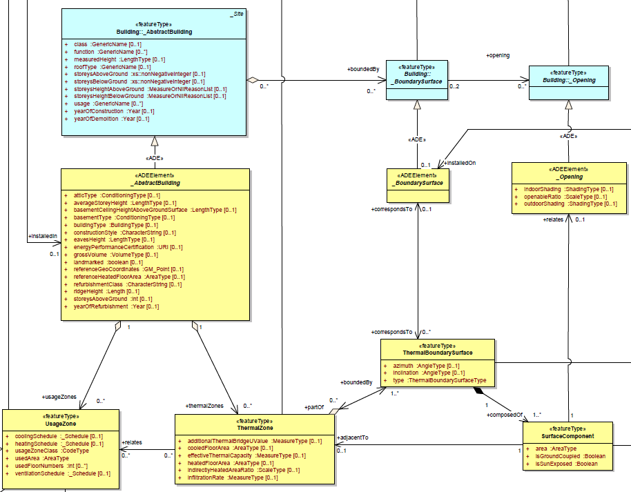
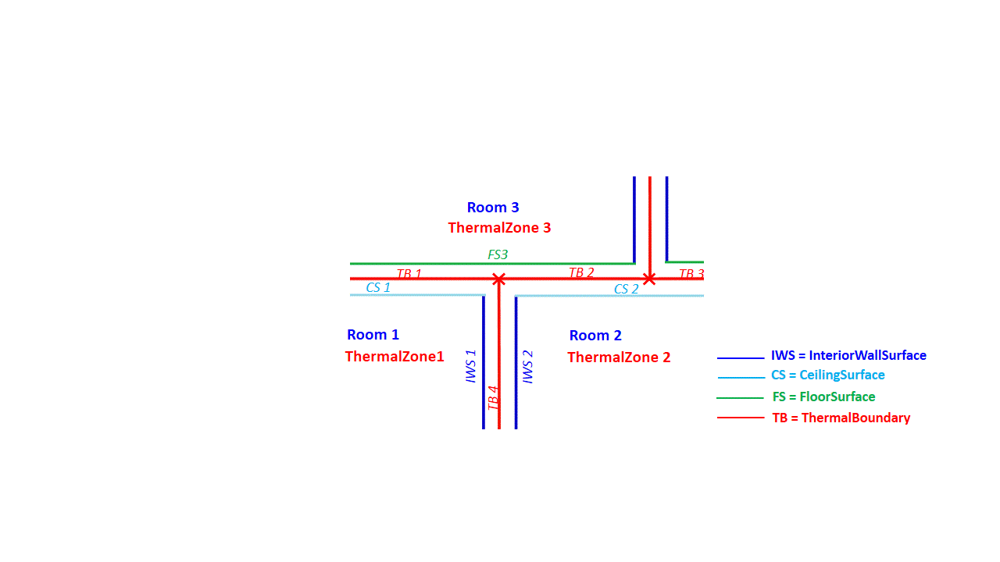
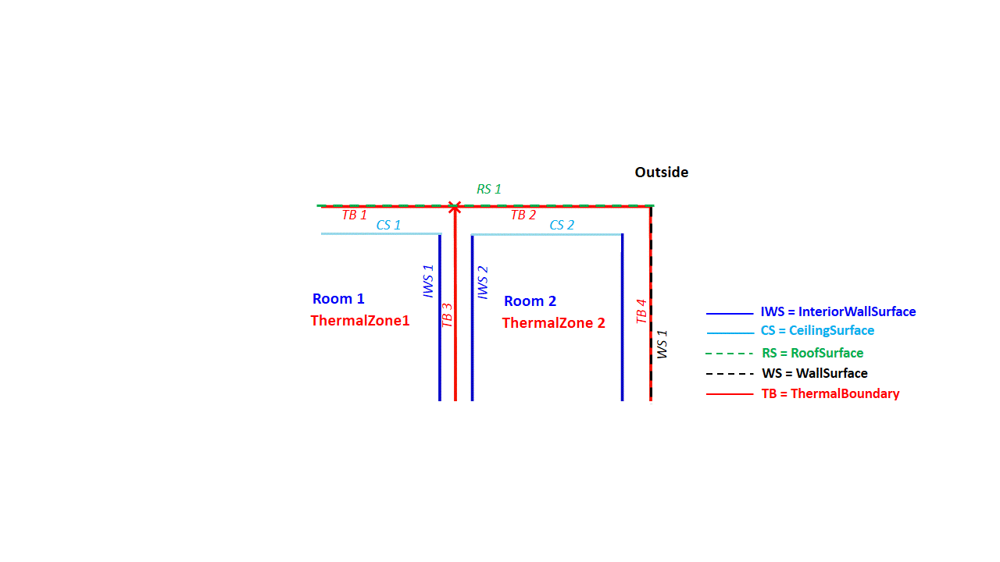
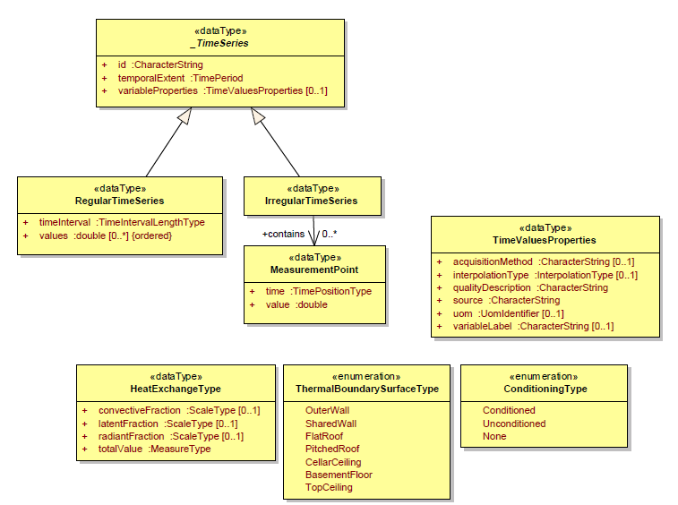
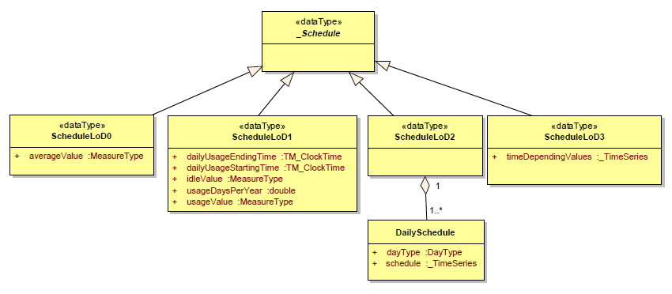
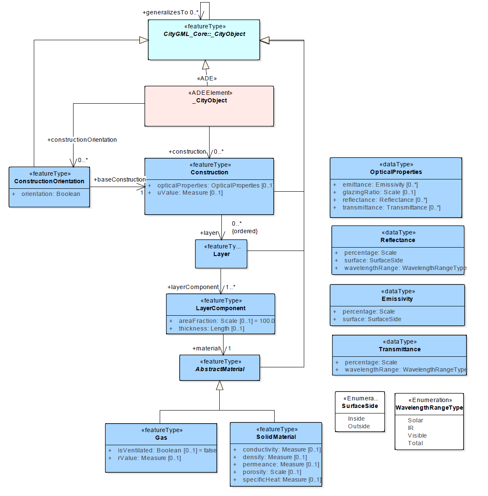
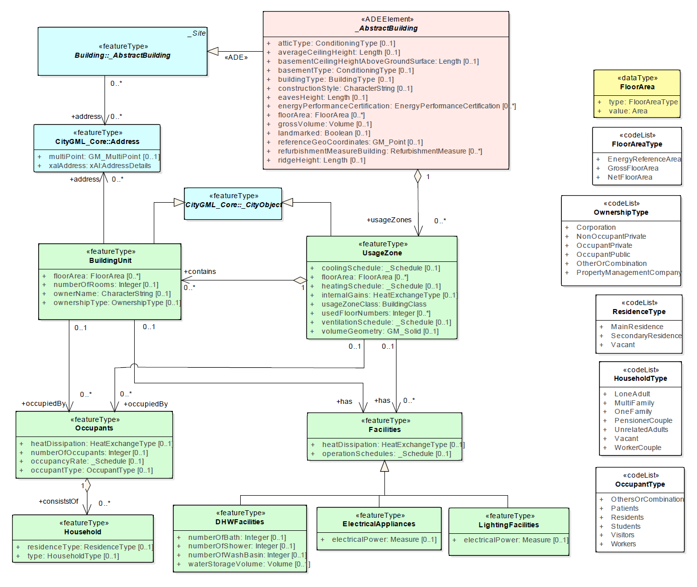
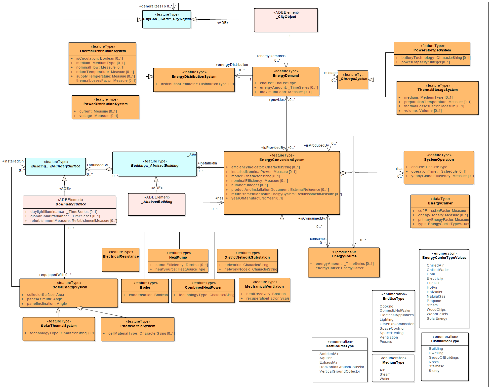

CityGML Application Domain Extension Energy<br/>Draft Guidelines - Version 0.6 
===============================================================================


Overview of the Application Domain Extension Energy
---------------------------------------------------

The CityGML Energy ADE aims at extending the CityGML standard with energy-related entities necessary to lead energy analyses at urban scale.

Following the philosophy of CityGML, this Energy ADE aims to be flexible, in terms of compatibility with different data qualities, levels of details, and urban energy models complexities (from monthly energy balance of ISO 13790, to sub-hourly dynamic simulation of softwares like CitySim or EnergyPlus). It takes into consideration the INSPIRE Directive of the European Parliament, as well as the recent US Building Energy Data Exchange Specification (BEDES).

Its structure is thought of as modular; some of its modules can be potentially used and extended for other applications (e.g. module Occupancy for socio-economics, module Materials for acoustics or statics, module Metadata and Scenarios for every urban analysis).


Building Physics Module
-----------------------

This central module of the Energy ADE contains the thermal building objects required for the building energy modelling (e.g. `ThermalZone`, `ThermalBoundary`, `ThermalComponent`). These thermal building objects are linked to the CityGML building objects through its `_AbstractBuilding`, `_BoundarySurface` and `_Opening` classes.


<h3>Building, zones and boundaries</h3>




**ThermalZone**

Zone of a building which serves as space unit for building heating/cooling simulations, a thermal zone is considered as isothermal. It is a semantic object, with an optional geometry, which may be or not related to a geometric entity (`gml:Building`, `gml:BuildingPart`, `gml:Room` etc.).

This class inherits from `_CityObject`, and may therefore be associated to 1 or more `EnergyDemand` objects (see module Energy systems).
For the requirement of the building heating/cooling simulations, the 'ThermalZone' must be related to one or more `UsageZone` (see Occupancy Module).


**ThermalBoundary**

Quasi-coplanar surface delimiting thermal zones. It represents the physical relationship between two thermal zones (defining the thermal zones adjacency) or a thermal zone and the building surrounding.

It is a semantic object, with an optional geometry. It may be linked to the `gml:BoundarySurface` (through the `ADE:_BoundarySurface`) when possible, but not necessary (e.g. cellar ceiling or top storey ceiling in the case of CityGML LoD1 to LoD3).

While separating two thermal zones, its optional geometry corresponds to the middle of the internal/share wall.
While separating a thermal zone from the building surrounding, its optional geometry corresponds to the external surface of the outer wall/roof/basement floor.

<!--


-->

**ThermalComponent**

Part of the thermal boundary corresponding to a homogeneous construction component (e.g. windows, wall, insulated part of a wall etc.).

This class inherits from `_CityObject`, and is generally associated to a Construction Object (see module Construction and Material).


**\_AbstractBuilding**

Extension of CityGML object `_AbstractBuilding` in Application Domain Extension Energy.


**\_BoundarySurface**

Extension of CityGML object `_BoundarySurface` in Application Domain Extension Energy.

Even empty, this subtype is necessary for the connection of the ADE Energy to the CityGML, since a bi-directional associations to the existing definitions is added.


**\_Opening**

Extension of CityGML object `_Opening` in Application Domain Extension Energy. Openings may have an indoor and an outdoor shading system. They are further defined by an openable ratio.


Temporal Data Module
--------------------

<h3>Time Series</h3>



Time series are homogeneous list of time-depending values. They are used in the Energy ADE to store energy amount or schedule for instance. As non-domain specific feature, they is planned to be integrated in the CityGML 3.0.

They have common properties specified in the type


**TimeValuesProperties**

These properties are the variable label, the variable unit of measure (*uom*), the interpolation type (based on the [WaterML ADE](http://def.seegrid.csiro.au/sissvoc/ogc-def/resource?uri=http://www.opengis.net/def/waterml/2.0/interpolationType/))
and some data acquisition information like the data source, the acquisition method and the quality description.

Time Series can be either regular or irregular.

**RegularTimeSeries** contain `values` generated at regularly spaced interval of time (`timeInterval`), over a given `temporalExtent` (= start, end and duration time). They are relevant for instance to store automatically acquired data or hourly/daily/monthly simulation results.

In **IrregularTimeSeries**, the data in the time series follows also a temporal sequence, but the measurement points might not happen at a regular time interval[^1]. Therefore, each value must be associated with a data or time.


<h3>Schedules</h3>



The type Schedule is used in the Energy ADE for different kinds of schedules and variables, including heating/cooling schedules (set-point temperatures), ventilation schedules (mechanical air change rate) and occupancy rate.

Schedules may be modelled with 4 "semantic levels of details" depending on the available information and the application.

**ConstantValueSchedule**

Most basic level of detail, it corresponds to a constant value, generally corresponding to the average parameter value.

```xml
<!--Example of the cooling schedule of a residential building:-->
<energy:coolingSchedule>
    <energy:ConstantValueSchedule*>
        <energy:averageValue uom="°C">26</energy:averageValue>
    </energy:ConstantValueSchedule*>
</energy:coolingSchedule>
```

**DualValueSchedule**

Two-state schedule, specified by a usage value defined for usage times, and an idle value outside this temporal boundaries. Information about the approximate number of usage days per year and usage hours per usage days are also defined (if these days are precisely known, then the schedules LoD2 or LoD3 may be used instead).

This Schedule LoD 1 complies in particular with the data requirements of the Codes and Norms describing the monthly energy balance (DIN 18599-2, ISO 13790).

```xml
<!--Example of the heating schedule of a residential building:-->
<energy:heatingSchedules>
    <energy:DualValueSchedule>
        <energy:usageValue uom="°C">20</energy:usageValue>
        <energy:idleValue uom="°C">16</energy:idleValue>
        <energy:usageHoursPerDay uom="">17</energy:usageHoursPerDay>
        <energy:usageDaysPerYear uom="">365</energy:usageDaysPerYeary>
    </energy:DualValueSchedule>
</energy:heatingSchedules>
```

**DailyPatternSchedule**

Detailed schedule composed of daily schedules associated to recurrent day types (weekday, weekend etc.).

These daily schedules are Time Series as described above.

**TimeSeriesSchedule**

Most detailed schedule corresponding to a Time series as described above.


Construction and Material Module
--------------------------------



The Construction and Material is a module of the ADE Energy, which contains the physical characterization of the boundary surfaces, surface components and even whole building (and potentially all the objects which inherits of `_CityObject`).

It may be extended for multi-field analysis (statics, acoustics etc.).

<h3>Construction and layers</h3>

**Construction**

Physical characterisation of building envelop or intern room partition (e.g.
wall, roof, openings), it may be specified as an ordered combination of layers.

The object Construction may be associated to the (thermal) boundary surfaces,
surface components, buildings (and potentially all the objects which inherits
of `_CityObject`).

It inherits itself from `_CityObject`.

**ConstructionOrientation**

Class defining the orientation convention of the Construction, it means the
order of the layers. A same Construction, common to different zones or
buildings, will be orientated in two different directions for instance.

**Layer**

Combination of one of more materials, referenced via a layer component.

It inherits from `_CityObject`.

**LayerComponent**

Homogeneous part of a layer, covering a given fraction (`areaFraction`) of the
layer.

<h3>Materials</h3>

**AbstractMaterial**

Abstract superclass for all Material classes. A Material is a homogeneous substance. We distinguish solid materials (with mass) from gas (without mass).

**SolidMaterial**

Class of the materials which have a mass and a heat capacity.

**Gas**

Class of the material whose mass and heat capacity are neglectable in comparison with `SolidMaterial`.


<h3>Optical properties</h3>

**Transmittance**

Fraction of incident radiation passes through a specific object.

It is specified for a given wavelength range type (`wavelengthRange`) .
In particular, the total transmittance of a window correspond to its *g-value* (also called Solar Heat Gain Coefficient).

The transmittance percentage should be included between 0% (opaque object) and 100% (transparent object).


**Reflectance**

Fraction of incident radiation which is reflected by an object.

It is specified for a given surface (`SurfaceSide`), for a given wavelength range type.
The sum of the transmittance, reflectance and the absorptance of a surface/object is always 1.

**Emissivity**

Ratio of the infrared (also called long-wave) radiation emitted by a specific surface /object to that of a black body.

It is specified for a given surface (SurfaceSide).
According with the Kirchoff and Lambert law, for a diffuse grey body, the aborptance and the emittance are equals for a given wavelength range.

**WavelengthRangeType**

solar, infrared, visible or total

Occupancy Module
----------------



The Occupancy Module is a module of the ADE Energy, which may be extended for multi-field analysis (socio-economics, demographics etc.).  It contains the characterization of the building usage, it is related to the rest of the ADE Energy and CityGML model through the unique class `UsageZone`.

<h3>Usage zone and Building Unit</h3>

**UsageZone**

Zone of a building with homogeneous usage type. It is a semantic object, with an optional geometry (`volumeGeometry`), which may be or not related to a geometric entity (Building, BuildingPart, Room etc.).

Its usage type is defined by a `usageZoneClass` (corresponding to the CityGML Code list of the `_AbstractBuilding` attribute class). This zone is operated with a single heating and cooling set-point temperature schedule (`heatingSchedule` respectively `coolingSchedule`) and single air ventilation schedule.

This class inherits from `_CityObject`, and may therefore be associated to 1 or more 'EnergyDemand' objects. This class is defined minimally by a usage zone class and a floor area.

Its `internalGains` attribute correspond to the sum of the energy dissipated from the occupants and the facilities inside the zone.


**BuildingUnit**

Part of usage zone which is related to a single occupant entity, such as dwelling or workplace. Owner information data (as owner name and ownership type) are specified in this class.

It inherits from `_CityObject`.

<h3>Occupants</h3>

**Occupants**

Homogeneous group of occupants of a usage zone or building unit, defined with an occupant type (e.g. residents, workers, visitors etc.).

**Household**

Group of persons living in the same dwelling, in the case where occupants are residents.

There are defined by a type (e.g. one family, worker couple etc…) and a residence type (main/secondary residence or vacant).

<h3>Facilities</h3>

Facilities and Appliances inside the usage zone or building unit, which consume and dissipate energy. They are distinguished between domestic hot water (`DHWFacilities`), specific electrical appliances (`ElectricalAppliances`) and lighting facilities (`LightingFacilities`).

**DHWFacilities**

**ElectricalAppliances**

**LightingFacilities**

Energy System Module
--------------------



The Energy System Module is a module of the ADE Energy, which contains the information concerning the energy forms (energy demand, supply, sources) and the energy systems (conversion, distribution and storage systems).

<h3>Energy Amounts and Forms</h3>

**EnergyDemand**

Useful energy required to satisfy a specific end use, such as heating, cooling, domestic hot water etc.
Beside its `EndUseType`, this object is characterized its `energyAmount` (time-depending energy demand value) and its maximum yearly load (`maximumLoad`) used for the sizing of the energy systems.

Every `_CityObject` (typically `ADE:_AbstractBuilding`, `ThermalZone`, `UsageZone` and `BuildingUnit`) may have one or more `EnergyDemand`.


**EnergySource**

Final energy consumed (and sometimes produced) by the energy conversion system.

Its energy characteristics are specified in the Energy Carrier object.

**EnergyCarrier**

(primary energy and CO2 emission factors, energy density, energy carrier type) 
 

<h3>Energy Distribution</h3>

**EnergyDistributionSystem**

System in charge of delivering the energy inside the building, from the place of energy production to the place of end-use. Power and Thermal distribution systems are differentiated.

**StorageSystem**

System storing energy. A same storage may store the energy of different end-users and different end uses. Power and Thermal storage systems are differentiated.


<h3>Energy Conversion</h3>

**EnergyConversionSystem**

System converting an energy source into the energy necessary to satisfy the end-use (or to feed the networks).

Energy conversion systems have common parameters: nominal installed power, nominal efficiency (in reference to an efficiency indicator), year of manufacture, name of the model. They may be one or more (in this case, the nominal installed power corresponds to the totality). Some product and installation documents may be referenced.

Specific energy conversion systems may have in addition specific parameters:

A same system may have several operation modes (e.g. heat pump covering heating and domestic hot water demands).

**SystemOperation**

It details the operation of the energy conversion system for a specific end-use and operation time.
For instance, a reversible heat pump may have 3 operation modes: heating production in winter, cooling production in summer, and hot water production during the whole year.


[^1]: [IBM knowledge Center](http://www-01.ibm.com/support/knowledgecenter/SSCRJU_3.0.0/com.ibm.swg.im.infosphere.streams.timeseries-toolkit.doc/doc/timeseries-regular.html)
